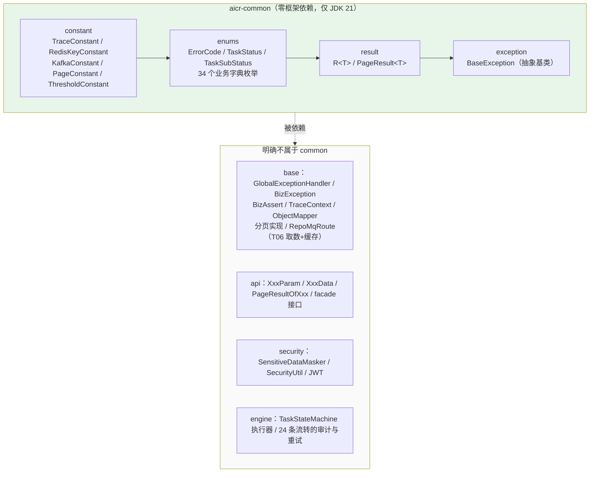
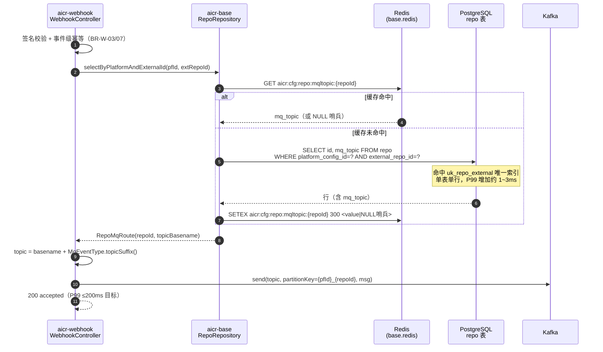
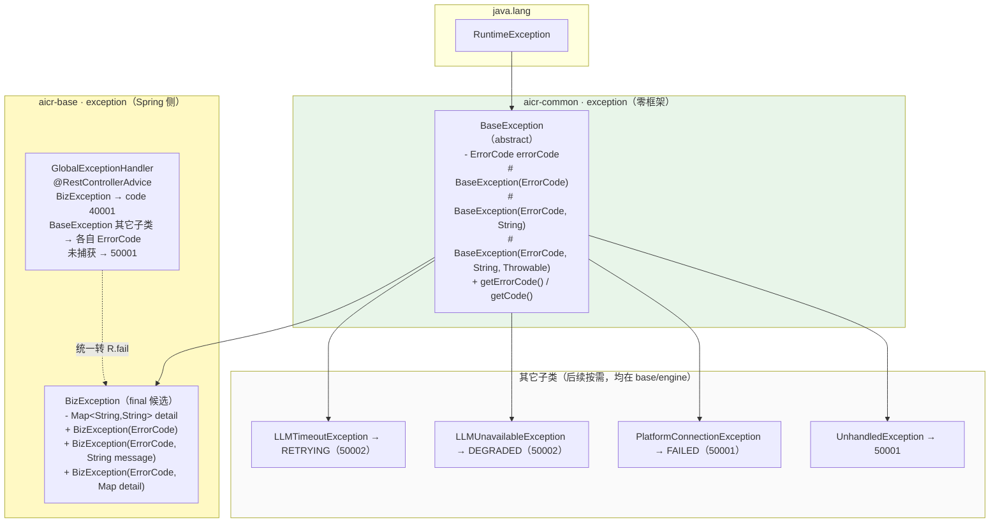
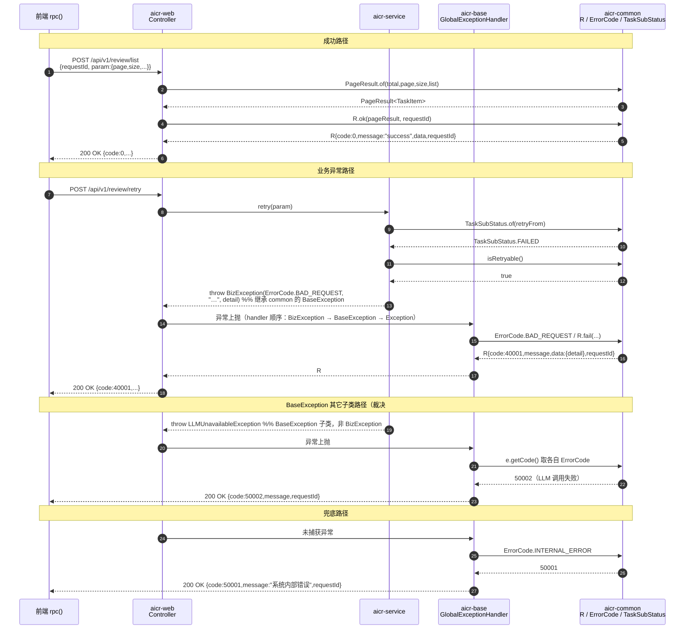
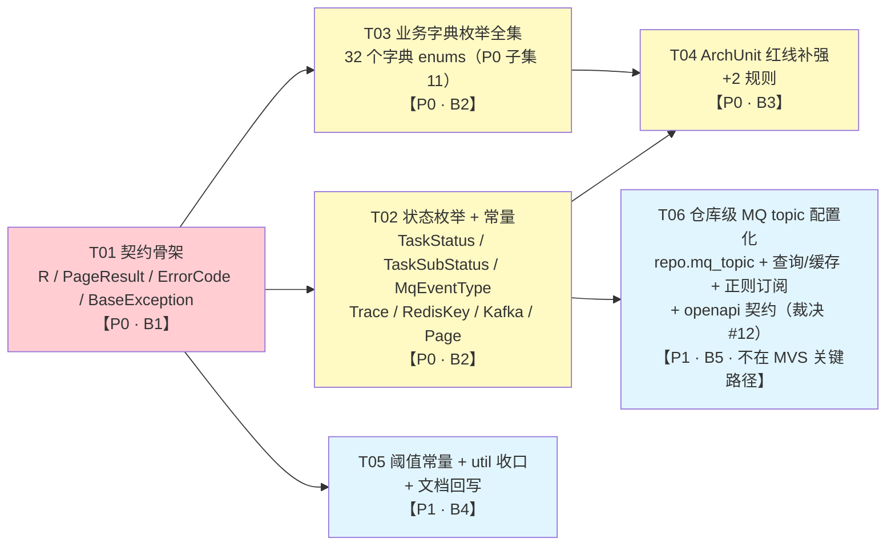
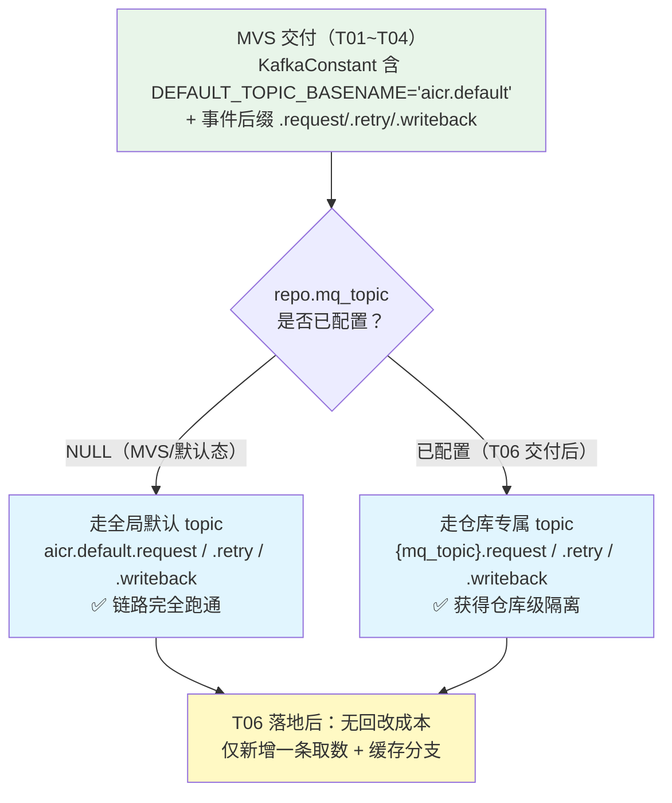

# aicr-common 模块 增量设计说明书

---

| 项 | 内容 |
|:---|:-----|
| 文档版本 | **v1.1**（v1.0 基础上并入交付总监三项裁决，见 §0.1 裁决记录） |
| 日期 | 2026-09-09 |
| 设计人 | 高见远（架构师） |
| 状态 | **三项裁决已并入（#1 / #12 / #13 已关闭）**；10 项按默认倾向锁定；剩余 2 项待办（#9 待核实、**#15 新增·需二次确认风险**） |
| 适用范围 | `aicr-common` 模块从"空模块（仅 pom）"到"可支撑其余 8 个模块开工"的增量落地 |
| 上游依据 | `HLD §2.4`、`LLD §2.4.2/§5.1/§6/§7/§8/§10/附录 B,C`、`编码规范`、`编码规范（后端 Java）`、`openapi.yaml`、`DBD §3.2.2/§3.5.1/§4.5/§7`、`开发分支管理规范`、`测试计划与策略` |

---

## 0.1 裁决记录（v1.1）

> 交付总监于 v1.0 评审后就 **3 项**待裁决事项作出裁决；其余 **10 项**按本文档 v1.0 的默认倾向方案执行。本节记录裁决内容、落点变更与影响。

### 0.1.1 裁决总表

| 编号 | 事项 | 裁决结果 | 与 v1.0 默认倾向的差异 | 影响等级 |
|:---|:---|:---|:---|:---|
| **#1** | 异常类命名与归属 | **`BusinessException` 改名为 `BizException`**，落在 **`aicr-base` 的 `com.joyintech.aicr.base.exception`**；`common.exception` **只保留 `BaseException`** | **一致且更强**：v1.0 倾向"BaseException 进 common、BusinessException 留 base"；裁决在此基础上**改名**为 `BizException` | 低（不阻塞 MVS） |
| **#12** | Kafka topic 配置方式 | **否掉 A/B 两选项**，改为：**topic 通过数据库配置，并与仓库（repo）绑定** | **重大变更**：v1.0 的两个选项均为"常量写死/逻辑名+配置映射"，裁决改为**仓库级数据配置** | **高**（新增跨 6 模块的 T06；但**不阻塞 MVS**，见 §8.4） |
| **#13** | common 是否可引 hutool | **允许引入，但必须精确到细分模块（如 `hutool-core`），禁止 `hutool-all`**；继续按"按需引入、能不用就不用"执行 | **放宽**：v1.0 倾向"MVS 零第三方"；裁决保留该执行原则，同时**开放引入通道** | 低（MVS 仍不引入） |
| #2 #3 #4 #5 #6 #7 #8 #10 #11 #14 | 未单独裁决 | **按 v1.0 默认倾向方案执行**（其中 #7 双口径按建议显式定义） | 无 | — |
| **#9** | ThresholdConstant 数值 | 仍按"核实后填入、本轮只落骨架"执行 | 无 | — |
| **#15（新增）** | 裁决 #12 引入的 3 项风险 | **待用户二次确认**（仓库量级 / 里程碑排期 / topic 命名强制规范），见 §9 | — | **高**（详见 §9 #15） |

### 0.1.2 本次修订的落点清单

| 章节 | 修订内容 |
|:---|:---|
| §0 | 修正 MVS 文件数口径（10 → **25**） |
| §1.3 | `BusinessException` 行 → 已裁决：`BizException` 归 `base.exception` |
| §2.4 | 新增第 26-a 条：异常命名裁决（与 `LLD §8.1` 原文冲突说明） |
| §3.1 | `KafkaConstant` 标注语义变更（不再是"全局 topic 常量"）；补 `BizException` 关联说明 |
| §3.4（新增） | **仓库级 MQ topic 配置的数据模型设计**（裁决 #12 的完整方案） |
| §4.4 | 重写：给出 `BizException` 完整签名 + 异常体系归属图 |
| §4.7 | `KafkaConstant` 重新设计（后缀/默认 topic/命名规范/降级） |
| §4.8 | 时序图更新：`BizException → 40001`、`BaseException` 其它子类 → 各自 ErrorCode |
| §5.1 / §5.4 / §5.5（新增） | hutool 策略修订；父 POM 需新增 `hutool-core` 的 `dependencyManagement`（**唯一需改父 POM 处**） |
| §6.1 / §6.2 | 任务表：**新增 T06**（P1 / B4，不进 MVS 关键路径）；更新依赖图 |
| §7.3 | ArchUnit：从禁列表移除 `cn.hutool..`，改为**精确禁 hutool 非 core 包** |
| §8.1 / §8.4（新增） | MVS **文件数不变（25 个）**；新增 §8.4 说明裁决 #12 为何不进关键路径 |
| §9 | #1/#12/#13 标记已关闭；10 项标记已锁定；**新增 #15**（3 项风险待二次确认） |
| §10 | 文档回写清单补充：`LLD §2.4.2`/`§8.1` 改名、`LLD §10.1` topic 重构、`DBD §3.2.2`/`§4.5`/`§7.2` 加列 |

### 0.1.3 对 MVS 与开工节奏的净影响

| 项 | v1.0 | **v1.1** | 变化 |
|:---|:---|:---|:---|
| MVS 文件数 | 25 | **25** | **不变**（`KafkaConstant` 保留但语义收窄为"默认 topic + 后缀 + 命名规范"，仍是降级路径必需） |
| MVS 是否新增/移除文件 | — | 无 | 无 |
| 任务数 | 5 | **6**（新增 T06） | +1，**T06 为 P1/B4，不进关键路径** |
| 是否阻塞 `aicr-api`/`aicr-base` 开工 | 否 | **否** | 不变 —— 裁决 #12 通过"未配置则走全局默认 topic"的降级路径与 MVS 解耦 |
| 是否可按 T01→T03 直接开工 | 是 | **是** | 不变（详见 §8.4 与回传摘要） |

---

## 0.2 现状与结论摘要

| 事实 | 说明 |
|:---|:---|
| 现状 | `aicr-common/` 仅有 `pom.xml`，**零源码**；其余 8 个模块（api/base/security/service/engine/web/webhook/worker）的 pom **已全部声明依赖 `aicr-common`** |
| 风险 | common 是全工程**编译期前置依赖**。它不落地，下游 8 个模块一动代码就编译失败；目前仅因它们也还没写代码而未暴露 |
| 红线 | 红线四：`common` 禁止依赖 Spring 与任何业务模块（Enforcer + ArchUnit 构建期强制）。Enforcer 已在 `aicr-common/pom.xml` 就位：`org.springframework:*`、`org.springframework.boot:*`、`com.joyintech:aicr-*` |
| 结论 | 本设计交付 **MVS 25 个 Java 文件**（main 22 + test 3，§8.1）即可解除全工程阻塞；完整版再补 21 个 P1 字典枚举、阈值常量、ArchUnit 规则补强与仓库级 MQ 配置化（T06） |
| 裁决 #12 影响 | Kafka topic 改为**仓库级数据库配置**（§3.4）。**不阻塞 MVS** —— 未配置时降级走全局默认 topic（§4.7） |

**一句话边界**：common = **全局契约的"值"与"码"**（响应结构、错误码、状态与字典枚举、跨模块常量），不含任何"行为"（无 I/O、无容器、无框架、无业务逻辑）。

---

## 1 定位与边界

### 1.1 准入判据（必须全部满足才可放入 `aicr-common`）

| 编号 | 判据 | 检验方式 |
|:---|:---|:---|
| **A1 零框架依赖** | 不得 `import` 任何 `org.springframework.*` / `org.springframework.boot.*` / `jakarta.*` / `org.mybatis.*` / `com.baomidou.*`；建议同时不依赖 `org.slf4j.*` / `com.fasterxml.jackson.*` | Enforcer（Spring/aicr-*）+ ArchUnit（包名级，§7.3 新增规则） |
| **A2 跨模块复用** | 被 **≥2 个 Maven 模块** 使用，或由 `HLD/LLD/openapi/编码规范` 明确为全局契约 | 在类 Javadoc 中写明"使用方：base / engine / webhook / …"，评审核对 |
| **A3 无业务语义** | 只承载"字典/码表/结构"，不含业务规则判断（如"是否可重试"这类**跨模块一致的静态判定**例外，见 §1.2 判例 5） | 评审 |
| **A4 无副作用** | 无 I/O、无网络、无文件、无线程、无静态可变状态、无配置读取 | 评审 + 单测（纯函数） |
| **A5 契约稳定** | 取值来自 `openapi.yaml` / `DBD §4.5` / `编码规范 §5,§6,§7`；不得在实现中发明编码 | §2 核对表 + 单测断言值集合 |

### 1.2 准出判据（命中任一即**不得**放入 common）

| 编号 | 判据 | 应归属 |
|:---|:---|:---|
| **B1** | 需要 Spring Bean / 容器 / 配置装配 | `aicr-base` |
| **B2** | 需要数据库 / Redis / Kafka 访问 | `aicr-base`（`repository` / `mq` / `redis`） |
| **B3** | 是 RPC 请求/响应 DTO 或 facade 接口 | `aicr-api`（`dto` / `facade`） |
| **B4** | 涉及认证、加解密、脱敏、签名 | `aicr-security`（`auth` / `crypto` / `webhook`） |
| **B5** | 仅单模块使用 | 留在该模块内（禁止"提前抽象"） |
| **B6** | 需要日志门面 / MDC 读写 | `aicr-base`（`trace`） |

### 1.3 争议项判定（逐项给理由）

| 争议项 | 判定 | 理由 |
|:---|:---|:---|
| **统一响应体 `R<T>`** | ✅ **进** `common.result` | ① `LLD §2.4.2` 已给 common 列 `result` 包；② `openapi §RpcEnvelopeResponse` 是 98 个接口的**全局契约**，`web`/`webhook` 两个可执行单元都要产出；③ `R` 本身只需 4 个字段 + 静态工厂，**不需要任何 Spring 类型** —— 序列化由 Spring MVC 的 Jackson 完成，`R` 不感知 |
| **分页结构 `PageResult<T>`** | ✅ **进** `common.result` | ① `openapi §PageResultBase`（`total/page/size`）+ 13 个 `PageResultOfXxx` 均为契约；② `base`（分页查询封装）、`service`（组装）、`api`（`data` 字段类型）三方共用，满足 A2；③ 泛型 `map()` 只依赖 JDK `java.util.function`，满足 A1/A4。<br>⚠️ 注意：`PageResultOfXxx`（引用具体 `XxxItem`）仍留在 `api.dto`；common 只给泛型容器 |
| **异常基类 / `BizException`** | ✅ **已裁决（#1）**：`BaseException`（零框架抽象基类）进 `common.exception`；**`BizException` 落在 `base.exception`，继承 `BaseException`** | 交付总监裁决：原 `BusinessException` **改名为 `BizException`**，归 `base.exception`；`common.exception` **只保留 `BaseException`**，不再讨论将 `BizException` 放入 common。本设计 v1.0 的倾向（拆分为基类在 common、业务异常在 base）与裁决一致，裁决额外确定了**命名**。<br>裁决后 `LLD §2.4.2`/`§8.1` 中的 `BusinessException` 需同步改名为 `BizException`（§10 回写清单）。详见 §4.4 |
| **TraceId 工具类** | ❌ **不进** common | MDC 是 SLF4J 门面能力（B6）；`X-Trace-Id` 头名与 MDC key 是**常量** → 进 `common.constant.TraceConstant`；生成/读写 → `base.trace.TraceContext`（`LLD §8.3`）。common 保持零依赖 |
| **ID 生成器（requestId / traceId / msgId）** | ❌ **不造轮子** | `UUID.randomUUID().toString()` 一行搞定（`openapi` 要求 `format: uuid`）；若后续引入 hutool-core 则 `IdUtil.fastUUID()`。不单建 `IdUtil` |
| **`Assert` 断言工具类** | ❌ **不进** common | 三重理由：① 会与 Jakarta `@Valid` + Spring `Assert` 形成**三套校验口径**；② 断言失败要抛 `BizException`（在 `base`，裁决 #1）→ 若 `Assert` 在 common 就产生 **common→base 的反向依赖**，直接违反"底层不反向依赖上层"（`HLD §2.4.3`）；③ 属单侧使用（service/web）。→ 由 `base` 提供 `BizAssert` |
| **`JsonUtil` / 引 jackson** | ❌ **不进** | 真正需要 `ObjectMapper` 的地方（LLM 响应解析、Redis 序列化、Kafka 消息）都在 `base`/`engine`，且应统一复用 **Spring 容器管理的那一个 ObjectMapper**，避免双份配置漂移（时间格式/时区/non_null）。common 引 jackson 只会把序列化注解污染进契约类 |
| **`MaskUtil` 脱敏 / 签名工具** | ❌ **不进** | `LLD §2.4.3` 关键类归宿表明确：`SensitiveDataMasker` → `security.crypto`；`SecurityUtil.verify` → `security.webhook`。进 common 会与 §2.4.3 冲突 |
| **状态机流转执行器** | ❌ **不进** | 24 条流转的**执行**（含审计日志、重试次数累加、Kafka 联动）属业务逻辑，仅 `engine` 使用（B5）→ `engine.pipeline.TaskStateMachine`。<br>但**静态流转判定表**进 common，见下一条 |
| **状态流转静态判定 `canTransitionTo()`** | ✅ **进** `common.enums.TaskSubStatus` | 三个以上模块要用：`webhook`（建任务写初值）、`worker`（消费前终态丢弃，`LLD §10.4`）、`service`（`review/retry` 校验 `retryFrom` 合法）；且表本身在 `LLD §6.2` 的 24 条 + §6.4 三条回退中已固化，无业务自由度。满足 A2 + A5 |
| **Kafka topic 名 / Redis key 前缀** | ✅ **进** `common.constant` | **硬需求**：`webhook` 生产消息、`worker` 消费消息，而 `webhook` **禁止依赖 service/engine**（红线三），二者没有共同的上层库 → common 是唯一可共享位置（`HLD §2.4.4` 矩阵中二者都 → common） |
| **阈值常量（Token/大变更/重试/配额）** | ✅ **进**（P1） | `编码规范（后端 Java）§3.3` + §7.3 明确要求"阈值必须常量化，禁止魔法值散落"；阈值被 `engine`（大变更降级）、`service`（配额告警）、`webhook` 共用，满足 A2 |

### 1.4 边界速查图



---

## 2 与现有文档的一致性核对表

> 图例：✅ 已明确（可直接落地）　⚠️ 文档未定义需补　❌ 与文档冲突需裁决

### 2.1 统一返回结构（`R<T>`）

| # | 约定 | 出处 | 状态 | 落地方式 |
|:--|:---|:---|:---|:---|
| 1 | 响应体 `{code, message, data, requestId}` | `LLD §5.1`、`编码规范 §3`、`openapi §RpcEnvelopeResponse` | ✅ | `R<T>` 四字段，顺序 `code → message → data → requestId` |
| 2 | `required: [code, message, requestId]`，`data` 非必填 | `openapi §RpcEnvelopeResponse` | ✅ | `data` 为泛型，可为 `null` |
| 3 | 成功时 `message = "success"` | `LLD §5.1` 响应示例 | ✅ | `ErrorCode.SUCCESS(0, "success")` |
| 4 | HTTP 状态码恒 200，业务错误由 `code` 表达 | `编码规范 §3` | ✅ | `R` 不含 HTTP status 字段 |
| 5 | 唯一例外 `POST /webhook/receive` 用 HTTP 200/400/401/503 | `编码规范 §3`、`SRS BR-W-09` | ✅ | 由 `webhook` 的 Controller 用 `ResponseEntity` 控制，**`R` 结构不变** |
| 6 | `data` 为 `null` 时 JSON 中是否输出 `"data":null` | `openapi` 未声明；`编码规范 §4.3` 只约束集合不返回 null | ⚠️ | 见 §9 待裁决 #10。**默认**：不在 `R` 上加 Jackson 注解，由 `base` 全局 `ObjectMapper` 配置 `default-property-inclusion=non_null` 统一决定 |
| 7 | 分页无结果返回 `list: []` 且 `total: 0`，不用 404 | `编码规范 §4.3` | ✅ | `PageResult.of()` 内部 `null → List.of()`；`empty()` 工厂 |

### 2.2 错误码

| # | 约定 | 出处 | 状态 | 落地方式 |
|:--|:---|:---|:---|:---|
| 8 | 错误码 `0/40001/40101/40301/40401` | `LLD §5.1`、`编码规范 §5.1` | ✅ | `ErrorCode` 枚举 |
| 9 | 错误码 `50001`（系统内部错误）/ `50002`（LLM 调用失败） | `LLD §5.1`（7 码齐全）、`编码规范 §5.1`、`openapi §RpcEnvelopeResponse.description`、前端设计说明书 §12 | ✅ **三份文档完全一致** | `ErrorCode` 落地 7 个码；`50002` 由 `engine` 抛出、前端提供重试按钮 |
| 10 | 禁止自定义新错误码 | `编码规范（后端 Java）§5.3` | ✅ | `ErrorCode` 为封闭枚举，不提供 "OTHER" 逃生口；确需新增须走 PR 同步 `openapi` + `编码规范 §5` + 前端 §12 |
| 11 | `40001` 时 `data` 可携带 `detail`（字段名→错误提示） | `编码规范 §5.2`（openapi 未定义） | ✅ | `R.fail(ErrorCode, Map<String,String> detail, requestId)`；`detail` 为可选 |
| 12 | 仅 `50001/50002` 提供用户可见重试 | `编码规范 §5.3` | ✅ | 前端职责；`ErrorCode` 可加 `retryable()` 便于后端统一判断（P2 可选） |

### 2.3 requestId / traceId

| # | 约定 | 出处 | 状态 | 落地方式 |
|:--|:---|:---|:---|:---|
| 13 | `requestId` 客户端生成（UUID），置于请求/响应体顶层，缺省服务端补全 | `编码规范 §7.1`、`LLD §8.3` | ✅ | `R` 的工厂方法接受 `requestId`；补全逻辑在 `base`（B6） |
| 14 | `traceId` 服务端在 Webhook 入口生成，HTTP 头 `X-Trace-Id` 透传 | `编码规范 §7.1`、`LLD §8.3` | ✅ | `TraceConstant.HEADER_TRACE_ID = "X-Trace-Id"` |
| 15 | 日志字段 `traceId, timestamp, level, thread, class, message, userId` | `LLD §8.2` | ✅ | （base 职责） |
| 16 | MDC 写入 `traceId`、`requestId`、`userId` | `LLD §8.3` | ⚠️ | **文档只给了 MDC 变量名，未给 key 字面量** → 本设计定义 `MDC_TRACE_ID="traceId"` / `MDC_REQUEST_ID="requestId"` / `MDC_USER_ID="userId"`（与 §8.2 日志字段名保持一致），见 §9 待裁决 #4 |
| 17 | Kafka 消息体 `{msgId, traceId, eventType, occurredAt, payload}`，`traceId` 在 `payload` 外 | `LLD §10.2`、`编码规范（后端 Java）§5.6` | ✅ | 消息封装在 `base.mq`；common 只提供 `eventType` 枚举 `MqEventType` 与 topic 名常量 |

### 2.4 状态枚举

| # | 约定 | 出处 | 状态 | 落地方式 |
|:--|:---|:---|:---|:---|
| 18 | 主状态 `status`：0 待处理/1 处理中/2 已完成/3 失败/4 已取消 | `LLD §6.1`、`DBD §5.1`、`openapi §MainStatus` | ✅ | `TaskStatus`（`int code`） |
| 19 | 业务状态 `sub_status` 共 14 个 | `LLD §6.2/附录B`、`编码规范 §6.1`、`openapi §SubStatus`、`DBD §5.1` | ✅ | `TaskSubStatus`（`String`，与库列 `VARCHAR(32)` 对齐） |
| 20 | 主状态 ↔ 业务状态映射（5↔14） | `LLD §6.3`、`DBD §5.1` | ✅ | `TaskSubStatus.mainStatus()` |
| 21 | 24 条流转 + 3 条受控回退（回退三条已含在 24 条表内） | `LLD §6.2`、`测试计划 §4.1/§8` | ✅ | `TaskSubStatus.canTransitionTo()` 静态表，**24 条全覆盖并单测** |
| 22 | 主状态单向不可逆 `0→1→2/3/4`，禁止 2/3/4 互转、禁止回退 0 | `LLD §6.1`、`DBD §5.1` | ✅ | `TaskStatus.canTransitTo()`（P2，主状态流转实际由 sub_status 驱动，可不实现） |
| 23 | **14 态的声明顺序** | `openapi §SubStatus` 顺序 vs `LLD 附录B` 顺序 **不一致** | ❌ | 见 §9 待裁决 #3。**默认按 `LLD 附录B`**（按主状态分组，语义聚合），并硬性约定 **禁止用 `ordinal()` 做持久化/传输** |
| 24 | 终态定义 | `LLD §10.4` 说终态 = `COMPLETED/FAILED/CANCELLED`；但 `openapi §ReviewRetryParam.retryFrom` = `FAILED/TIMEOUT/DEGRADED/PARTIAL_SUCCESS` | ⚠️ | 两个口径不同 → 枚举提供**两个方法**：`isTerminal()`（MQ 丢弃口径：COMPLETED/FAILED/CANCELLED）与 `isRetryable()`（可重试口径：FAILED/TIMEOUT/DEGRADED/PARTIAL_SUCCESS）。**这是本文档对文档空白的显式定义**，见 §9 待裁决 #7 |
| 25 | Java 枚举类名 `TaskSubStatus` vs openapi schema `SubStatus` | `README 关键约定` 写 `TaskSubStatus`；`编码规范 §6.2` 写 `SubStatus` | ❌ | 见 §9 待裁决 #2 |
| 26 | 列表展示与筛选一律用 `sub_status`（14 态） | `编码规范 §6.1`、`SRS §6.1` | ✅ | （下游职责） |

### 2.5 其它字典枚举

| # | 约定 | 出处 | 状态 | 落地方式 |
|:--|:---|:---|:---|:---|
| 27 | 18 个业务字典"以 openapi 的 components.schemas 为准" | `编码规范 §6.2` | ✅ | 逐一按 `openapi` 的 enum 值落地（§3.2 清单） |
| 28 | 枚举值大写+下划线 / 数字型枚举用 int | `编码规范 §4.1` | ✅ | `ConfirmStatus/VerifyStatus/CaseSource/EnableStatus/TriggeredBy/MainStatus` 为 int 型枚举，其余 String |
| 29 | 新增枚举值属兼容变更；前端对未知值展示原始值 | `编码规范 §6.3` | ✅ | 后端可先行；枚举 `of()` 解析失败返回 `Optional.empty()` 而非抛异常，避免"未知值白屏" |
| 30 | 数据库 CHECK 约束取值须与枚举一致 | `DBD §4.5` | ✅ | §3.2 每个枚举标注"DBD 列"，单测断言值集合 |
| 31 | `AUDITOR`/`OPERATOR` 为 v1.0 预留不实现 | `LLD §7.2`、`开发分支管理规范 §4.5` | ✅ | `RoleCode` **含**这两个值（openapi 已声明），但加 `@Deprecated`? 不推荐 → 改为 Javadoc 注明"v1.0 不启用，禁止在权限判定分支中使用" |
| 32 | `QuotaStatusEnum` schema 名带 `Enum` 后缀，`SubjectType`(DEPT/PROJECT) 与 `PermSubjectType`(ROLE/DEPT) 需消歧 | `openapi §1198-1222` | ⚠️ | Java 侧命名：`QuotaStatus` / `QuotaSubjectType` / `PermSubjectType`，Javadoc 注明 schema 映射。见 §9 待裁决 #11 |

### 2.6 模块与包结构

| # | 约定 | 出处 | 状态 | 落地方式 |
|:--|:---|:---|:---|:---|
| 33 | common 包结构 = `common.{constant,enums,util,result,exception}` | `LLD §2.4.2` | ✅ | 严格遵守；`util` 当前为空包（§3.3 说明理由） |
| 34 | common 职责 = 常量/枚举/工具类/统一返回；禁 Spring、禁业务模块 | `编码规范（后端 Java）§4`、`HLD §2.4.2` | ✅ | §1 准入判据 |
| 35 | 红线四由 Enforcer + ArchUnit 强制 | `HLD §2.4.5`、`LLD 附录C` | ⚠️ | **现有 ArchUnit 规则只约束"谁可以访问 common"，未约束"common 不能访问别人"，且未覆盖 jakarta/slf4j/jackson** → §7.3 补 2 条规则 |
| 36 | 子模块禁止自带 `<version>` / `<groupId>`；只声明 `groupId:artifactId` | `编码规范（后端 Java）§2` | ✅ | 本设计不新增 `<version>` |
| 37 | 常量集中定义，禁止魔法值散落 | `编码规范（后端 Java）§3.3` | ✅ | `constant` 包 |

---

## 3 包结构与文件清单

### 3.1 目录树

```
aicr-common/
├─ pom.xml                                    （已存在，本轮建议不改；见 §5.4）
└─ src/
   ├─ main/java/com/joyintech/aicr/common/
   │  ├─ constant/
   │  │  ├─ TraceConstant.java          [P0] 链路标识：HTTP 头名 + MDC key
   │  │  ├─ RedisKeyConstant.java       [P0] 幂等键/锁键/缓存键模式 + TTL
   │  │  ├─ KafkaConstant.java          [P0] ⚠️裁决#12后语义收窄：仅事件后缀 / 系统级+默认topic / 命名规范 / 分区键（见 §3.4、§4.7）
   │  │  ├─ PageConstant.java           [P0] 分页边界（1 / 20 / 100）
   │  │  └─ ThresholdConstant.java      [P1] 阈值（Token/大变更/重试/配额）— 数值待核实
   │  ├─ enums/
   │  │  ├─ ErrorCode.java              [P0] 7 个错误码（唯一口径）
   │  │  ├─ TaskStatus.java             [P0] 主状态 5 个（int）
   │  │  ├─ TaskSubStatus.java          [P0] 业务状态 14 个 + 流转判定
   │  │  ├─ MqEventType.java            [P0] Kafka eventType 5 个
   │  │  ├─ RoleCode.java               [P0] ADMIN/PM/QA/DEVELOPER/AUDITOR/OPERATOR
   │  │  ├─ PlatformType.java           [P0] GITLAB/GITHUB/GITEA
   │  │  ├─ ModelScene.java             [P0] REVIEW/TEST_GEN
   │  │  ├─ NotifyChannel.java          [P0] WECOM/DINGTALK/FEISHU/EMAIL
   │  │  ├─ TriggerCondition.java       [P0] 4 个通知触发条件
   │  │  ├─ EnableStatus.java           [P0] 0/1 通用启用状态
   │  │  ├─ DataScope.java              [P0] ALL/DEPT_AND_SUB/SELF
   │  │  ├─ ResourceType.java           [P0] REVIEW_TASK/DASHBOARD/RULE
   │  │  ├─ PermSubjectType.java        [P0] ROLE/DEPT（数据权限主体）
   │  │  ├─ MenuType.java               [P0] 1/2/3 目录/菜单/按钮（DBD）
   │  │  ├─ UserSource.java             [P0] LDAP/OIDC（FR-014 用户同步）
   │  │  ├─ HealthStatus.java           [P1] UP/DEGRADED/DOWN
   │  │  ├─ Dimension.java              [P1] BUG/PERFORMANCE/SECURITY/STYLE/READABILITY
   │  │  ├─ Severity.java               [P1] BLOCKER/CRITICAL/MINOR
   │  │  ├─ RiskLevel.java              [P1] HIGH/MEDIUM/LOW
   │  │  ├─ Scenario.java               [P1] POSITIVE/BOUNDARY/EXCEPTION
   │  │  ├─ ConfirmStatus.java          [P1] 0/1/2
   │  │  ├─ VerifyStatus.java           [P1] 0/1/2
   │  │  ├─ CaseSource.java             [P1] 0/1
   │  │  ├─ TriggeredBy.java            [P1] 0/1
   │  │  ├─ PromptCategory.java         [P1] SYSTEM/REVIEW/TEST_GEN/COMMON
   │  │  ├─ FallbackMode.java           [P1] STANDARD/STREAMLINED/QUICK_SCAN/SHARDED
   │  │  ├─ ChangeType.java             [P1] FEATURE/BUGFIX/REFACTOR/CHORE/OTHER
   │  │  ├─ FeedbackType.java           [P1] CONFIRM/REJECT
   │  │  ├─ QuotaSubjectType.java       [P1] DEPT/PROJECT
   │  │  ├─ QuotaPeriod.java            [P1] MONTH/WEEK
   │  │  ├─ ResetType.java              [P1] AUTO/MANUAL
   │  │  ├─ QuotaStatus.java            [P1] NORMAL/WARN/CRITICAL/BLOCKED
   │  │  ├─ Granularity.java            [P1] DAY/WEEK/MONTH
   │  │  ├─ ReviewTraceNodeType.java    [P1] FILE/REQUIREMENT/ISSUE/TESTCASE
   │  │  ├─ WebhookReceiveStatus.java   [P1] accepted/ignored/duplicate
   │  │  └─ EvaluateConclusion.java     [P1] ok/sampleInsufficient
   │  ├─ result/
   │  │  ├─ R.java                      [P0] 统一响应体 {code,message,data,requestId}
   │  │  └─ PageResult.java             [P0] 分页响应 {total,page,size,list}
   │  ├─ exception/
   │  │  └─ BaseException.java          [P0] 零框架异常基类（ErrorCode + message）
   │  └─ util/
   │     └─ package-info.java           [P2] 空包占位 + 准入判据 Javadoc（见 §3.3）
   └─ test/java/com/joyintech/aicr/common/
      ├─ result/
      │  ├─ RTest.java                  [P0]
      │  └─ PageResultTest.java         [P0]
      ├─ enums/
      │  ├─ ErrorCodeTest.java          [P0]
      │  ├─ TaskSubStatusTest.java      [P0] 24 条流转 + 映射 + 终态 + 可重试
      │  ├─ TaskStatusTest.java         [P0]
      │  └─ DictEnumTest.java           [P1] 全量字典：值集合 vs openapi/DBD
      └─ constant/
         └─ ConstantTest.java           [P1] 常量非空/格式/TTL 关系
```

**文件计数**：main 45 个（constant 5 + enums 36 + result 2 + exception 1 + util 1）+ test 7 个 = **52 个文件**；其中 **MVS 只需 25 个**（§8.1）。

> **v1.1 变更说明（三项裁决后）**：
> ① `KafkaConstant` **保留但语义收窄** —— 不再承载"全局 topic 常量"，改为"事件后缀 + 系统级/默认 topic + 命名规范 + 分区键"（§4.7）；
> ② `RedisKeyConstant` **新增 1 个常量** `CFG_REPO_MQ_TOPIC`（仓库 topic 配置缓存，T06 用，§4.7）；
> ③ `exception` 包**只保留 `BaseException`**；`BizException` 属 `aicr-base`，**不在本清单内**（其签名见 §4.4.3，属关联交付物）；
> ④ 总数 **52 个不变**，MVS **25 个不变**。裁决 #12 新增的仓库级 topic 能力全部落在 T06（跨 6 模块），不新增 common 文件。

### 3.2 枚举 ↔ 契约/数据库 对齐表（防"自造编码"）

| Java 枚举 | 类型 | openapi schema | DBD 列（`§4.5`） | 优先级 |
|:---|:---|:---|:---|:---:|
| `ErrorCode` | int + msg | `RpcEnvelopeResponse.code` | — | P0 |
| `TaskStatus` | int | `MainStatus` | `review_task.status` | P0 |
| `TaskSubStatus` | String | `SubStatus` | `review_task.sub_status` | P0 |
| `MqEventType` | String | — | —（`LLD §10.3`） | P0 |
| `RoleCode` | String | `RoleCode` | `sys_role.role_code` | P0 |
| `PlatformType` | String | `PlatformType` | `platform_config.platform_type` | P0 |
| `ModelScene` | String | `ModelScene` | `model_config.scene` | P0 |
| `NotifyChannel` | String | `NotifyChannel` | `notification_config.channel` | P0 |
| `TriggerCondition` | String | `TriggerCondition` | —（notification_config） | P0 |
| `EnableStatus` | int | `EnableStatus` | 通用 `status` 列 | P0 |
| `DataScope` | String | `DataScope` | `data_permission.scope` | P0 |
| `ResourceType` | String | `ResourceType` | `data_permission.resource_type` | P0 |
| `PermSubjectType` | String | `PermSubjectType` | `data_permission.subject_type` | P0 |
| `MenuType` | int | — | `sys_menu.menu_type`（1/2/3） | P0 |
| `UserSource` | String | `UserSyncParam.source` | — | P1 |
| `HealthStatus` | String | `MonitorHealthData.status` | — | P1 |
| `Dimension` | String | `Dimension` | `review_rule.dimension`、`review_comment.dimension` | P1 |
| `Severity` | String | `Severity` | `review_rule.severity`、`review_comment.severity` | P1 |
| `RiskLevel` | String | `RiskLevel` | —（阶段一输出） | P1 |
| `Scenario` | String | `Scenario` | `test_case.scenario` | P1 |
| `ConfirmStatus` | int | `ConfirmStatus` | `review_comment.confirm_status` | P1 |
| `VerifyStatus` | int | `VerifyStatus` | `test_case.verify_status` | P1 |
| `CaseSource` | int | `CaseSource` | `test_case.source` | P1 |
| `TriggeredBy` | int | `TriggeredBy` | `review_task.triggered_by` | P1 |
| `PromptCategory` | String | `PromptCategory` | `prompt_template.category` | P1 |
| `FallbackMode` | String | `FallbackMode` | `review_task.fallback_mode` | P1 |
| `ChangeType` | String | `ChangeType` | `review_change_analysis.change_type` | P1 |
| `FeedbackType` | String | `FeedbackType` | —（Kafka FEEDBACK payload） | P1 |
| `QuotaSubjectType` | String | `SubjectType` | `cost_quota.subject_type`、`cost_consumption.subject_type` | P1 |
| `QuotaPeriod` | String | `QuotaPeriod` | `cost_quota.period` | P1 |
| `ResetType` | String | `ResetType` | `cost_quota.reset_type` | P1 |
| `QuotaStatus` | String | `QuotaStatusEnum` | —（计算态，`SRS FR-021`） | P1 |
| `Granularity` | String | `Granularity` | — | P1 |
| `ReviewTraceNodeType` | String | `ReviewTraceNodeType` | — | P1 |
| `WebhookReceiveStatus` | String | `webhook/receive` 响应 `status` | — | P1 |
| `EvaluateConclusion` | String | `PromptEvaluateData.conclusion` | — | P1 |

> **命名消歧说明**：`SubjectType`（openapi）= `DEPT/PROJECT`，属配额域 → Java 命名 `QuotaSubjectType`；`PermSubjectType`（openapi）= `ROLE/DEPT`，属数据权限域 → 同名。二者不可合并（`DBD §4.5` 明确为两组不同 CHECK）。

### 3.3 关于 `util` 包为什么是空的

`LLD §2.4.2` 给 common 列了 `util` 子包，但按 §1.1 准入判据逐条筛查后，**当前没有任何工具类满足准入**：

| 候选 | 筛查结果 |
|:---|:---|
| `IdUtil` | JDK `UUID.randomUUID()` 一行，A5 无需 → 淘汰 |
| `JsonUtil` | 违反 A1（jackson）+ §1.3 判例 → 淘汰（归 `base`） |
| `Assert/BizAssert` | 会造成 common→base 反向依赖 → 淘汰（归 `base`） |
| `MaskUtil` | `LLD §2.4.3` 已归 `security.crypto` → 淘汰 |
| `TimeUtil` | 时间格式由 Jackson 全局配置统一，A5/A2 不成立 → 淘汰 |
| `TreeUtil` | 仅 `service.perm` 使用（B5）→ 淘汰 |

因此：**`util` 包保留一个 `package-info.java`**（Git 不跟踪空目录，且可承载准入判据的 Javadoc），首个真正满足准入的工具类落地时再补。这是刻意选择 —— **不为了凑齐包结构而造轮子**。

---

### 3.4 仓库级 Kafka topic 配置的数据模型（裁决 #12）

> **裁决 #12（重大变更，已关闭）**：Kafka topic **通过数据库配置，并与仓库（repo）绑定**。
> topic 从"全局常量"变为"**按仓库维度可配置的数据**"。本节给出存储、粒度、取数、降级、消费端与文档回写的完整方案。
>
> **对 `aicr-common` 的净影响**：`KafkaConstant` **保留但语义收窄**（§4.7）；`RedisKeyConstant` **新增 1 个缓存 key**（§4.7）；
> `MqEventType` **不变**。**MVS 文件数不变（25 个）**，本方案整体作为 **T06（P1/B4）** 独立交付，不进 MVS 关键路径（§8.4）。

#### 3.4.1 存储方案三选一

| 方案 | 描述 | 评价 |
|:---|:---|:---|
| ① `platform_config` 加列 | 在平台接入表加 topic 列 | ❌ **否决**。语义错位：`platform_config` = 平台（GitLab/GitHub/Gitea）的 API 地址 + 凭据，**全局仅 3 条左右**，无法表达"按仓库"；且 topic 与 `platform_type` 无函数依赖关系 |
| ② **`repo` 表加 1 列** | 仓库表加 `mq_topic`（topic **基名**） | ✅ **推荐**。见下方理由 |
| ③ 新建仓库级 MQ 配置表 | `repo_mq_config(repo_id, event_type, topic, ...)` | ⚠️ **备选**。扩展性最好，但会**使表数从 26 → 27**，连锁修订 DBD §3 表清单/§7 脚本清单/LLD §4，且多一次 JOIN |

**推荐方案 ②，理由**：

1. **维度天然 1:1** —— topic 与仓库绑定，仓库表正是仓库维度唯一事实来源；
2. **复用既有查询路径** —— `repo` 已有唯一约束 `uk_repo_external(platform_config_id, external_repo_id)`，`webhook` 收到回调后**本来就要**用它定位 `repo`（否则拿不到 `repo_id` 写 `review_task`），取 topic 是**零额外查询**（见 §3.4.4）；
3. **不新增表** —— 保持 DBD "26 张表" 口径不变，避免连锁文档修订；
4. **`V1__init.sql` 尚未入库** —— 经核实，仓库中**不存在** `aicr-worker/src/main/resources/db/migration/` 目录与任何 `*.sql` 文件（DBD §7.2 描述的 `V1__init.sql` 仍在设计态）。因此加列**直接写入 `V1__init.sql` 基线即可，零迁移成本、无需增量脚本**；
5. **与 `platform_config.platform_type` 的关系** —— 二者**无直接依赖**：`platform_type` 决定 Webhook 解析策略与 Diff API 形态，`mq_topic` 决定消息路由；仓库经 `repo.platform_config_id` 外键间接关联平台，topic 只与仓库自身有关。

> ⚠️ **若后续确认需要"每仓库 × 每事件类型独立配置分区数/重试策略"**，再升级为方案 ③（新建 `repo_mq_config`），届时按《开发分支管理规范 §6.1》走增量脚本 `V{yyyyMMdd}_01__create_repo_mq_config.sql`。**当前不预判该需求**。

#### 3.4.2 DDL 草案（写入 `V1__init.sql` 的 `CREATE TABLE repo`）

```sql
CREATE TABLE repo (
    id                 BIGINT       GENERATED BY DEFAULT AS IDENTITY PRIMARY KEY,
    repo_name          VARCHAR(128) NOT NULL,
    platform_config_id BIGINT       NOT NULL,
    external_repo_id   VARCHAR(64),
    project_id         BIGINT,
    default_branch     VARCHAR(128),
    main_language      VARCHAR(32),
    test_strategy_id   BIGINT,
    -- ▼ 裁决 #12 新增列：该仓库专属「评审链路」Kafka topic 基名
    mq_topic           VARCHAR(64)  NULL,
    -- 其余公共列（status / created_at / updated_at …）沿用 V1 既有定义
    CONSTRAINT uk_repo_external UNIQUE (platform_config_id, external_repo_id),
    -- 命名规范：worker 正则订阅的前提（§3.4.6），与 KafkaConstant.TOPIC_NAME_PATTERN 一致
    CONSTRAINT ck_repo_mq_topic CHECK (mq_topic IS NULL OR mq_topic ~ '^[a-zA-Z0-9._-]{1,64}$')
);

COMMENT ON COLUMN repo.mq_topic IS
  '仓库级 Kafka topic 基名（裁决 #12）。实际 topic = mq_topic + 事件后缀'
  '（.request/.retry/.writeback，见 KafkaConstant）。NULL = 未配置，走全局默认基名 aicr.default。'
  '变更须同步失效缓存键 aicr:cfg:repo:mqltopic:{repoId}。';
```

| 项 | 决策 | 说明 |
|:---|:---|:---|
| 类型/长度 | `VARCHAR(64) NULL` | Kafka topic 名最长 249 字符，此处按"基名"收敛到 64，留足后缀空间 |
| 可空 | **是（NULL）** | NULL = 走全局默认，**这是"不阻塞 MVS"的降级支点**（§3.4.5） |
| 默认值 | **不设 DEFAULT** | 显式 NULL 比"默认填充"语义更清晰；绝大多数仓库无需配置（见 §9 #15-R1） |
| 索引 | **不建** | 查询路径是 `uk_repo_external` 命中后取该行的列，**不是**按 `mq_topic` 检索；建索引是纯浪费 |
| CHECK | `mq_topic ~ '^[a-zA-Z0-9._-]{1,64}$'` | 与 `KafkaConstant.TOPIC_NAME_PATTERN` 同源，保证 worker 正则订阅可用 |
| 唯一性 | **不建唯一约束** | 允许多个仓库共用同一 topic（如多个仓库共享隔离域）；唯一性由运维规范保证，见 §9 #15-R3 |

#### 3.4.3 粒度：每仓库一个 topic（基名 + 事件后缀派生）

| 方案 | topic 数（N 个仓库） | 评价 |
|:---|:---|:---|
| A. 每仓库 1 个 topic（全事件共用） | N | ❌ 破坏隔离：回写/重试与评审请求挤在同一 topic，无法差异化分区数与重试策略 |
| **B. 每仓库 1 个基名 + 事件后缀派生（3 个）** | **3N** | ✅ **推荐** —— 配置量仍是"1 行/仓库"，但保留事件级隔离 |
| C. 每仓库 × 每事件类型独立可配（5 个） | **5N** 配置行 | ❌ 配置量 ×5，运维噩梦；且 `FEEDBACK`/`NOTIFY` 分区键不是仓库，拆开无收益 |

**推荐方案 B**，并进一步按 `LLD §10.1` 的**分区键**做切分：

| `MqEventType` | LLD §10.1 分区键 | 是否走仓库级 topic | 实际 topic |
|:---|:---|:---|:---|
| `REVIEW_REQUEST` | `{platformConfigId}_{repoId}` | ✅ 是 | `{mq_topic}.request` |
| `REVIEW_RETRY` | `{platformConfigId}_{repoId}` | ✅ 是 | `{mq_topic}.retry` |
| `WRITEBACK` | `{platformConfigId}_{repoId}` | ✅ 是 | `{mq_topic}.writeback` |
| `FEEDBACK` | `{taskId}` | ❌ 否（保持全局） | `TOPIC_FEEDBACK` |
| `NOTIFY` | `{channel}` | ❌ 否（保持全局） | `TOPIC_NOTIFY` |
| （DLQ） | 无 | ❌ 否（保持全局） | `TOPIC_REVIEW_DLQ` |

**对 `MqEventType` 的影响**：枚举本身**不变**（仍是 5 个事件），但需**新增后缀语义**，建议在枚举上挂一个方法保持单一事实来源：

```java
public enum MqEventType {
    REVIEW_REQUEST(KafkaConstant.SUFFIX_REVIEW_REQUEST, true),
    REVIEW_RETRY  (KafkaConstant.SUFFIX_REVIEW_RETRY,   true),
    WRITEBACK     (KafkaConstant.SUFFIX_WRITEBACK,      true),
    FEEDBACK      (null, false),   // 系统级全局 topic
    NOTIFY        (null, false);   // 系统级全局 topic

    /** 事件后缀；null 表示该事件使用系统级全局 topic，不按仓库派生。 */
    public String topicSuffix()
    /** 是否按仓库派生 topic。 */
    public boolean repoScoped()
}
```

> 在 common 枚举里直接引用 `KafkaConstant` 常量 —— 二者同模块、同属"契约"，不违反 A1/A2。

#### 3.4.4 webhook 侧取数路径（红线三约束下的方案）

**约束**：`aicr-webhook` 禁止依赖 `service` / `engine`，**允许依赖 `base` + `common`**。



**要点**：

- **零额外查询**：定位 `repo` 是 webhook 的**既有动作**（要写 `review_task.repo_id`），顺带取 `mq_topic` 列，不新增 SQL。
- **P99 ≤200ms 影响评估**：命中 `uk_repo_external` 唯一索引的单行主键/索引查找，实测量级 **1~3ms**；相对 200ms 预算占比 <2%，**可接受**。
- **缓存方案**：**推荐 Redis**（而非本地缓存）。理由：① `webhook` 已装配 `base`（含 Redis），零新增依赖；② webhook 是多实例部署（≥50 QPS），本地 `ConcurrentHashMap`/Caffeine 会产生**实例间不一致窗口**；③ 配置类数据变更频率极低，Redis 一次 GET 约 0.3ms，不构成瓶颈。
  - **缓存 key**：复用 `RedisKeyConstant.CFG_REPO_MQ_TOPIC = "aicr:cfg:repo:mqltopic:%s"`，TTL `TTL_CFG_REPO_MQ_TOPIC_SECONDS = 300`（§4.7）。
  - **NULL 必须缓存**（哨兵值，如空串或 `"__NULL__"`），否则"未配置的仓库"会每次穿透到 DB，形成**缓存穿透**。
- **失效策略**：
  1. **主动失效**（主）：`web` 侧管理端修改仓库配置时，由 `service` 直接 `DEL aicr:cfg:repo:mqltopic:{repoId}` —— `web` 依赖 `service`，**webhook 只依赖 key 名（来自 common）**，不产生红线冲突。这正是"key 名放 common"的价值所在。
  2. **自然过期**（兜底）：TTL 5 分钟，最坏情况下配置变更 5 分钟内生效，**业务可接受**（topic 配错只影响消息路由，不影响已入队消息）。
- **红线校验**：整条链路 `webhook → base → Redis/PG`，**不触碰 service / engine** ✅。

#### 3.4.5 配置缺失时的降级行为（"不阻塞 MVS"的支点）

| 场景 | 行为 | 理由 |
|:---|:---|:---|
| `repo.mq_topic IS NULL`（仓库已登记但未配 topic） | **降级到 `KafkaConstant.DEFAULT_TOPIC_BASENAME`（`aicr.default`）**，正常建任务并入队；记 **WARN** 日志（含 `repoId`、`traceId`）+ 计数指标 `aicr.mq.topic.fallback` | Webhook 已接收的 MR **不能丢**；这是绝大多数仓库的默认态 |
| 仓库未登记（`repo` 查不到，`review_task.repo_id` 为空） | 同上，**必然**走默认 topic | DBD 明确 `review_task.repo_id` 可空、"未匹配到已登记仓库时为空"，属既有正常路径 |
| 已配置但 **topic 在 Kafka 不存在** | 生产侧：`KafkaProducer` 按 `auto.create.topics.enable` 行为处理（**建议显式预建**）；失败则记 ERROR 并按 webhook 重试机制处理（BR-W-10） | 属运维配置错误，需可观测 |
| 严格模式开关 `aicr.mq.strict-repo-topic=true` | 仓库已登记但 topic 缺失 → **拒绝并返回 HTTP 503**（对齐 `webhook/receive` 的 200/400/401/503 语义） | 默认 **false**；仅在需要强制隔离的环境（如涉密仓库域）开启 |

> **为什么这条支撑"不阻塞 MVS"**：MVS 阶段**所有仓库都不配置** `mq_topic`，全部走默认 topic —— 即 **T06 未交付时系统行为与裁决前完全一致**。
> 因此 `aicr-api` / `aicr-base` 可先按"全局默认 topic"开工，T06 后续以纯增量方式叠加，**无回改成本**。

#### 3.4.6 worker 侧消费（动态多 topic）

| 方案 | 复杂度 | 评价 |
|:---|:---|:---|
| A. 启动时加载全量仓库配置 + `KafkaListenerEndpointRegistry` 动态注册/注销 container | **高** | 需自建注册/注销/配置变更监听；灵活但重 |
| **B. `@KafkaListener(topicPattern = ...)` 正则订阅** | **低** | ✅ **推荐** —— Spring Kafka 原生属性，Kafka 原生能力 |
| C. 运行时轮询 DB + 增量注册 | 中高 | 引入轮询与一致性复杂度，无必要 |

**推荐方案 B（正则订阅）**：

```java
// aicr-worker
@KafkaListener(
    topicPattern = "aicr\\.repo\\..*\\.request",   // 与 KafkaConstant 命名规范配套
    groupId = "${aicr.mq.group.review-request}",
    concurrency = "${aicr.mq.concurrency.review-request:3}")
public void onReviewRequest(ConsumerRecord<String, String> record) { /* … */ }
```

- **为什么可行**：裁决 #12 已要求 topic 与仓库绑定，配合 §3.4.2 的 CHECK 命名规范（`aicr.repo.{repoId}.{suffix}` 或仓库自定义基名），
  正则可稳定收敛；**新建 topic 由 Kafka 元数据刷新自动纳入**（`metadata.max.age.ms`，默认 5 分钟，可下调至 30s 缩短发现延迟）——
  **无需任何代码热更新**。
- **代价与边界**（需团队知悉）：
  1. **无法为单个 topic 单独设并发度/重试策略** —— 但同类型 topic 本就应同质，符合 `LLD §10.1` 同类分区数一致的设计；
  2. **正则过宽会误订阅无关 topic** —— 依赖命名规范强制（DB CHECK + 管理端表单校验双保险，见 §9 #15-R3）；
  3. **系统级 topic（`FEEDBACK`/`NOTIFY`/`DLQ`）仍用 `topics = 常量` 静态订阅**（它们本就固定）。
- **升级路径**：若未来确需"每仓库不同并发度/重试策略"，再升级为方案 A —— 复杂度**完全落在 `worker`**，不影响 common 与其它模块。

#### 3.4.7 与 LLD / DBD 的冲突与回写清单

| 文档 | 位置 | 现状 | 需修订为 |
|:---|:---|:---|:---|
| `LLD` | §10.1 Topic 清单 | 6 个固定 topic + 固定分区数 | 改为"**逻辑事件 + 仓库级可配 topic**"：REQUEST/RETRY/WRITEBACK 为 `{repo.mq_topic}+后缀`（未配置走 `aicr.default`），分区键在仓库级 topic 内可简化为 `{repoId}`；FEEDBACK/NOTIFY/DLQ 保持全局 |
| `LLD` | §10.2 消息通用结构 | `{msgId, traceId, eventType, occurredAt, payload}` | **不变** ✅ |
| `LLD` | §10.3 事件类型与 Payload | 5 个 eventType | **不变**（仅 `MqEventType` 增加 `topicSuffix()`/`repoScoped()` 语义）✅ |
| `LLD` | §10.4 消费幂等 | `aicr:mq:consumed:{msgId}` | **不变** ✅ |
| `LLD` | §10.5 重试与死信 | DLQ 全局 | **不变**（DLQ 保持全局）✅ |
| `LLD` | §2.4.2 包结构 | — | 补注：`base.repository` 提供 `RepoMqRoute` 查询；`base.redis` 提供配置缓存 |
| `HLD` | §2.4.6 部署单元 | webhook P99 ≤200ms | **不变**（§3.4.4 已评估 +1~3ms 可接受）；建议补一句"仓库路由走 Redis 缓存" |
| `DBD` | §3.2.2 `repo` 表 | 7 列 | **加 `mq_topic VARCHAR(64) NULL` + CHECK + 列注释** |
| `DBD` | §4.5 字典 | — | 可选：增加"Kafka topic 命名规范"条目 |
| `DBD` | §7.2 脚本清单 | `V1__init.sql` = 26 表 DDL + 种子 | **加列直接进 `V1__init.sql`**（该脚本尚未入库，无需增量脚本）✅ |
| `openapi.yaml` | `RepoItem`（仓库管理） | — | **新增可选字段 `mqTopic`**（写操作 `RepoSaveParam` 同步新增），属兼容变更（`编码规范 §9`） |

---

## 4 关键类设计

> 约定：所有类不加任何 Jackson/Spring 注解；`final` 字段 + 静态工厂；Javadoc 注明"契约出处 + 使用方"。

### 4.1 `result/R.java` —— 统一响应体

```java
package com.joyintech.aicr.common.result;

/**
 * 统一 RPC 响应体 {@code {code, message, data, requestId}}。
 *
 * <p>契约出处：openapi {@code RpcEnvelopeResponse} / LLD §5.1 / 编码规范 §3。
 * HTTP 状态码恒为 200，业务错误由 code 表达（唯一例外见 webhook/receive）。
 *
 * <p>使用方：aicr-base（GlobalExceptionHandler）、aicr-web、aicr-webhook。
 * 本类不引任何序列化注解，字段输出策略由 base 的全局 ObjectMapper 统一配置。
 */
public final class R<T> {

    /** 0=成功；40001/40101/40301/40401/50001/50002（ErrorCode）。 */
    private final int code;
    /** 提示信息；参数校验失败时 message 为概览，字段级明细置于 data.detail。 */
    private final String message;
    /** 业务数据；可为 null（写操作成功时）。 */
    private final T data;
    /** 与请求一致，缺省由服务端补全（编码规范 §7.1）。 */
    private final String requestId;

    private R(int code, String message, T data, String requestId) { /* ... */ }

    // —— 成功 ——
    public static <T> R<T> ok()                                  // data=null, requestId=null（由上层补全）
    public static <T> R<T> ok(String requestId)
    public static <T> R<T> ok(T data)
    public static <T> R<T> ok(T data, String requestId)

    // —— 失败 ——
    public static <T> R<T> fail(ErrorCode errorCode)
    public static <T> R<T> fail(ErrorCode errorCode, String requestId)
    public static <T> R<T> fail(ErrorCode errorCode, String message, String requestId)   // 覆盖默认文案
    public static <T> R<T> fail(ErrorCode errorCode, Map<String, String> detail, String requestId) // 40001 字段级
    public static <T> R<T> fail(int code, String message, String requestId)              // 兜底（不推荐）

    // —— 读取 ——
    public int getCode()
    public String getMessage()
    public T getData()
    public String getRequestId()
    public boolean isSuccess()      // code == ErrorCode.SUCCESS.code()
    /** 用给定 requestId 复制一份（供 base 在入口补全 requestId 后回填）。 */
    public R<T> withRequestId(String requestId)
}
```

**要点**：
- `R` 是**不可变**对象（`final` 字段 + 私有构造），避免 Controller/拦截器之间的意外共享。
- 不提供 `setXxx` —— 补全 `requestId` 走 `withRequestId()` 返回新实例。
- `Map<String,String> detail` 仅用于 `40001`，对应 `编码规范 §5.2`。

### 4.2 `result/PageResult.java` —— 分页响应

```java
package com.joyintech.aicr.common.result;

/**
 * 分页响应 {@code {total, page, size, list}}。
 *
 * <p>契约出处：openapi {@code PageResultBase}（required: total/page/size）+ 13 个 {@code PageResultOfXxx}。
 * 约定：list 永不返回 null，无数据时为 []（编码规范 §4.3）。
 *
 * <p>使用方：aicr-base（分页查询封装）、aicr-service（组装）、aicr-api（data 字段类型）。
 */
public class PageResult<T> {

    private long total;
    private int page;
    private int size;
    private List<T> list;

    protected PageResult() {}

    public static <T> PageResult<T> of(long total, int page, int size, List<T> list) {
        // list == null → List.of()；page/size 兜底为 PageConstant.DEFAULT_*
    }
    public static <T> PageResult<T> empty()                       // page=1, size=20
    public static <T> PageResult<T> empty(int page, int size)
    /** 元素类型转换：Entity → DTO，list 为 null 安全。 */
    public <R> PageResult<R> map(Function<? super T, ? extends R> mapper)
    /** 计算总页数（size 为 0 时返回 0，防除零）。 */
    public long getTotalPages()

    // getters
}
```

**要点**：`map()` 只依赖 `java.util.function.Function`（JDK），不引任何三方；`PageResultOfXxx` 这类**引用具体 Item 类型**的结构留在 `api.dto`，common 不感知具体业务类型。

### 4.3 `enums/ErrorCode.java` —— 错误码唯一口径

```java
package com.joyintech.aicr.common.enums;

/**
 * 全局错误码（唯一口径）。
 *
 * <p>契约出处：openapi {@code RpcEnvelopeResponse.code} / 编码规范 §5.1 / LLD §5.1。
 * 三份文档口径一致（0/40001/40101/40301/40401/50001/50002），共 7 个码。
 *
 * <p>使用方：aicr-base（GlobalExceptionHandler）、aicr-security（40101/40301）、
 * aicr-engine（50002）、aicr-api、aicr-web、aicr-webhook。
 * 禁止自定义新码（编码规范（后端 Java）§5.3）。
 */
public enum ErrorCode {

    SUCCESS(0, "success"),
    BAD_REQUEST(40001, "参数校验失败"),
    UNAUTHORIZED(40101, "未登录或Token过期"),
    FORBIDDEN(40301, "无权限"),
    NOT_FOUND(40401, "资源不存在"),
    INTERNAL_ERROR(50001, "系统内部错误"),
    LLM_ERROR(50002, "LLM调用失败"),
    ;

    private final int code;
    private final String message;

    ErrorCode(int code, String message) { this.code = code; this.message = message; }

    public int code()
    public String message()
    /** 仅 50001/50002 提供用户可见重试（编码规范 §5.3）。 */
    public boolean retryable()      // this == INTERNAL_ERROR || this == LLM_ERROR
    public static ErrorCode of(int code)          // 未知返回 null（不抛异常，避免掩盖真实错误）
    public static boolean isSuccess(int code)     // code == 0
}
```

### 4.4 异常体系：`common.BaseException` + `base.BizException`（裁决 #1）

> **裁决 #1（已关闭）**：原 `BusinessException` **改名为 `BizException`**，落在 **`aicr-base` 的 `com.joyintech.aicr.base.exception`**；
> `aicr-common.exception` **只保留 `BaseException`**。`LLD §2.4.2` / `§8.1` 中的 `BusinessException` 需同步改名（§10 回写清单）。

#### 4.4.1 异常体系归属



> **分层理由**：`BaseException` 只承载 `code + message`，零框架；`BizException` 需要承载**字段级 `detail`** 并与 Spring 的
> `GlobalExceptionHandler` 配对使用，故留在 `base`。`engine` / `webhook` 抛业务异常时依赖 `base`（依赖矩阵允许），不直接继承
> `BaseException` —— 保证"所有业务异常都能被 GlobalExceptionHandler 统一转 40001"，不出现捕获盲区。

#### 4.4.2 `common.exception.BaseException`（本模块交付物）

```java
package com.joyintech.aicr.common.exception;

import com.joyintech.aicr.common.enums.ErrorCode;

/**
 * 零框架异常基类：只承载 {@code code + message}，不依赖任何容器。
 *
 * <p>契约出处：LLD §8.1（异常 → 错误码映射）、编码规范（后端 Java）§5.3。
 *
 * <p>使用方：aicr-base 的 {@code BizException} 继承本类（裁决 #1，原名 BusinessException 已改名）；
 * aicr-engine / aicr-webhook 如需自定义异常，继承 base 的 BizException，**不直接继承本类**，
 * 以免出现 GlobalExceptionHandler 捕获不到的异常分支。
 *
 * <p>异常 → 错误码映射（LLD §8.1，裁决后口径）：
 * BizException → 40001；BaseException 其它子类 → 各自 ErrorCode（如 50002 / 50001）；
 * 未捕获异常 → 50001。
 */
public abstract class BaseException extends RuntimeException {

    private final ErrorCode errorCode;

    protected BaseException(ErrorCode errorCode) {
        this(errorCode, errorCode.message());
    }

    protected BaseException(ErrorCode errorCode, String message) {
        super(message);
        this.errorCode = errorCode;
    }

    protected BaseException(ErrorCode errorCode, String message, Throwable cause) {
        super(message, cause);
        this.errorCode = errorCode;
    }

    /** 错误码枚举（语义化）。 */
    public ErrorCode getErrorCode() { return errorCode; }

    /** 错误码数值（= errorCode.code()），供 GlobalExceptionHandler 直接写入 R.code。 */
    public int getCode() { return errorCode.code(); }
}
```

#### 4.4.3 `base.exception.BizException`（**关联交付物，不在本模块文件清单内**）

> 归属 `aicr-base`，由 T01 之后的 base 首个 PR 落地；此处给出签名以锁定契约，避免两个模块各自演化。

```java
package com.joyintech.aicr.base.exception;

import com.joyintech.aicr.common.enums.ErrorCode;
import com.joyintech.aicr.common.exception.BaseException;

/**
 * 业务异常：参数校验失败 / 业务规则不满足。被 GlobalExceptionHandler 统一转为 code = 40001。
 *
 * <p>裁决 #1：原名 BusinessException，改名为 BizException，归属 aicr-base，继承 common 的 BaseException。
 *
 * <p>使用方：aicr-service（业务规则）、aicr-engine / aicr-webhook（自定义异常的父类）。
 * 构造签名按裁决给出三重载；{@code detail} 对应《编码规范》§5.2 的字段级错误明细。
 */
public class BizException extends BaseException {

    /** 字段级错误明细：key = 字段名，value = 错误提示（编码规范 §5.2）。可为 null。 */
    private final Map<String, String> detail;

    /** 使用 ErrorCode 默认文案。 */
    public BizException(ErrorCode errorCode) {
        this(errorCode, errorCode.message(), null);
    }

    /** 覆盖默认文案（最常见）。 */
    public BizException(ErrorCode errorCode, String message) {
        this(errorCode, message, null);
    }

    /** 携带字段级明细，供 40001 响应体的 data.detail 使用。 */
    public BizException(ErrorCode errorCode, Map<String, String> detail) {
        this(errorCode, errorCode.message(), detail);
    }

    private BizException(ErrorCode errorCode, String message, Map<String, String> detail) {
        super(errorCode, message);
        this.detail = (detail == null || detail.isEmpty()) ? null : Map.copyOf(detail);
    }

    public Map<String, String> getDetail() { return detail; }
}
```

#### 4.4.4 `GlobalExceptionHandler` 转换规则（`base`，对齐 LLD §8.1）

| 捕获类型 | 输出 `code` | 输出 `message` | `data` | 依据 |
|:---|:---|:---|:---|:---|
| **`BizException`** | **40001** | `e.getMessage()` 原样透传 | 有 `detail` 时 → `{"detail": {...}}`，否则 `null` | `LLD §8.1`、`编码规范 §5.2` |
| `BaseException` 其它子类（`LLMTimeoutException` 等） | `e.getCode()`（**各自 ErrorCode**，如 50002） | `e.getMessage()` | `null` | 裁决 #1 的转换规则 |
| `MethodArgumentNotValidException`（`@Valid` 失败） | 40001 | `参数校验失败` | `{"detail": {字段: 提示}}` | `编码规范 §5.2` |
| `HttpRequestMethodNotSupportedException` 等 Spring 异常 | 40001 | 框架原始信息（脱敏后） | `null` | 兜底 |
| **未捕获异常（含 `Exception` / `Error`）** | **50001** | `系统内部错误`（**不回传原始堆栈**） | `null` | `LLD §8.1` |

> ⚠️ **转换要点**：handler 必须**先**捕获 `BizException`（40001），**再**捕获 `BaseException`（走 `getCode()`），
> **最后**才是 `Exception`（50001）。若顺序写反，`BizException` 会被更宽的 `BaseException` 分支吃掉，
> 导致本该 40001 的参数错误被返回成 50002 之类 —— 这是本裁决落地时最容易踩的坑，须有单测覆盖。

### 4.5 `enums/TaskStatus.java` —— 主状态（5）

```java
/**
 * 任务主状态 review_task.status（int），仅用于统计聚合（编码规范 §6.1）。
 * 单向不可逆：0 → 1 → 2/3/4；禁止 2/3/4 互转、禁止回退 0（LLD §6.1 / DBD §5.1）。
 */
public enum TaskStatus {
    PENDING(0, "待处理"),
    PROCESSING(1, "处理中"),
    COMPLETED(2, "已完成"),
    FAILED(3, "失败"),
    CANCELLED(4, "已取消"),
    ;
    private final int code;
    private final String label;
    public static TaskStatus of(Integer code)   // null → null
}
```

### 4.6 `enums/TaskSubStatus.java` —— 业务状态（14）+ 流转判定（**本模块最核心的类**）

```java
/**
 * 任务业务状态 review_task.sub_status（String），全局唯一口径，共 14 个。
 *
 * <p>契约出处：LLD §6.2 / 附录B（声明顺序依据）、openapi {@code SubStatus}、编码规范 §6.1、DBD §5.1。
 * ⚠️ 禁止使用 ordinal() 做持久化或传输，一律用 name()（与库列 VARCHAR 对齐）。
 *
 * <p>使用方：aicr-webhook（建任务写初值）、aicr-worker（消费前终态丢弃）、
 * aicr-engine（状态推进与审计）、aicr-service（列表筛选与 retry 校验）、aicr-api（DTO 字段类型）。
 */
public enum TaskSubStatus {

    // ── 主状态 0 待处理 ──
    RECEIVED       ("已接收",           TaskStatus.PENDING),
    PARSING        ("解析中",           TaskStatus.PENDING),
    QUEUED         ("排队中",           TaskStatus.PENDING),

    // ── 主状态 1 处理中 ──
    ANALYZING      ("分析中",           TaskStatus.PROCESSING),
    GENERATING_TEST("测试生成中",       TaskStatus.PROCESSING),
    WRITING_BACK   ("回写中",           TaskStatus.PROCESSING),
    RETRYING       ("重试中",           TaskStatus.PROCESSING),
    TIMEOUT        ("超时",             TaskStatus.PROCESSING),

    // ── 主状态 2 已完成 ──
    COMPLETED      ("已完成",           TaskStatus.COMPLETED),
    PARTIAL_SUCCESS("部分成功",         TaskStatus.COMPLETED),
    DEGRADED       ("降级完成",         TaskStatus.COMPLETED),

    // ── 主状态 3 失败 ──
    FAILED         ("失败",             TaskStatus.FAILED),

    // ── 主状态 4 已取消 ──
    CANCELLED      ("已取消",           TaskStatus.CANCELLED),
    SKIPPED_QUOTA  ("已跳过（配额不足）", TaskStatus.CANCELLED),
    ;

    private final String label;
    private final TaskStatus mainStatus;

    /** 主状态映射（LLD §6.3）。 */
    public TaskStatus mainStatus()

    /** 是否为终态（MQ 丢弃口径：COMPLETED / FAILED / CANCELLED，LLD §10.4）。 */
    public boolean isTerminal()

    /** 是否允许作为人工重试来源（FAILED/TIMEOUT/DEGRADED/PARTIAL_SUCCESS，openapi §ReviewRetryParam）。 */
    public boolean isRetryable()

    /**
     * 静态流转判定（LLD §6.2 的 24 条，含 §6.4 三条受控回退）。
     * ⚠️ 本方法只做"是否合法"判定，不含执行语义（审计/重试计数/Kafka 联动在 engine）。
     */
    public boolean canTransitionTo(TaskSubStatus target)

    /** 合法后继集合（供 engine 状态机与前端"可操作"按钮态推导）。 */
    public Set<TaskSubStatus> nextStatuses()

    public static TaskSubStatus of(String code)                       // 未知 → null（编码规范 §6.3 兜底）
    public static Set<TaskSubStatus> terminalStatuses()
    public static Set<TaskSubStatus> retryableStatuses()
}
```

**流转表（LLD §6.2，24 条，`canTransitionTo` 的静态数据源）**：

| From | → To（合法后继） |
|:---|:---|
| RECEIVED | PARSING, SKIPPED_QUOTA |
| PARSING | QUEUED, FAILED |
| QUEUED | ANALYZING, CANCELLED |
| ANALYZING | GENERATING_TEST, WRITING_BACK, RETRYING, FAILED, DEGRADED, CANCELLED |
| RETRYING | ANALYZING, FAILED |
| GENERATING_TEST | WRITING_BACK, PARTIAL_SUCCESS, CANCELLED |
| WRITING_BACK | COMPLETED, PARTIAL_SUCCESS, TIMEOUT |
| TIMEOUT | RETRYING, FAILED |
| PARTIAL_SUCCESS | WRITING_BACK |
| DEGRADED | ANALYZING |
| COMPLETED / FAILED / CANCELLED / SKIPPED_QUOTA | （无，终态） |

> 合计 24 条边，与 `测试计划 §4.1 / §8` 的"24 条流转 + 终态重入保护"口径一致，单测须逐条断言。

### 4.7 `constant` 包关键常量

```java
/** 链路标识（LLD §8.3 / 编码规范 §7.1）。使用方：base.trace、web、webhook、worker。 */
public final class TraceConstant {
    public static final String HEADER_TRACE_ID  = "X-Trace-Id";
    public static final String MDC_TRACE_ID     = "traceId";    // ⚠️ 文档未给字面量，见待裁决 #4
    public static final String MDC_REQUEST_ID   = "requestId";
    public static final String MDC_USER_ID      = "userId";
    private TraceConstant() {}
}

/** 幂等键 / 锁键 / 缓存键（编码规范 §7.2、LLD §2.3、LLD §10.4）。使用方：webhook、worker、engine。 */
public final class RedisKeyConstant {
    public static final String WEBHOOK_EVENT_ID  = "WEBHOOK_EVENT_ID:%s";     // TTL 24h
    public static final String WEBHOOK_BIZ_DEDUP = "%s_%s_%s";                // {platformConfigId}_{repoId}_{mrId}，60s
    public static final String MQ_CONSUMED       = "aicr:mq:consumed:%s";     // TTL 7d
    public static final String ANALYSIS_INTENT   = "ANALYSIS_INTENT:%s";      // TTL 24h
    public static final String LOCK_REPO         = "aicr:lock:repo:%s";       // 无 TTL，依赖 watchdog
    /** 仓库级 MQ topic 配置缓存（裁决 #12，§3.4.4）；由 web 侧改配置时主动 DEL，webhook 只读。 */
    public static final String CFG_REPO_MQ_TOPIC = "aicr:cfg:repo:mqltopic:%s"; // TTL 5min
    public static final long TTL_WEBHOOK_EVENT_SECONDS = 24 * 60 * 60L;
    public static final long TTL_BIZ_DEDUP_SECONDS     = 60L;
    public static final long TTL_MQ_CONSUMED_SECONDS   = 7 * 24 * 60 * 60L;
    public static final long TTL_ANALYSIS_INTENT_SECONDS = 24 * 60 * 60L;
    /** 配置类缓存：短 TTL，允许分钟级不一致（§3.4.4）。 */
    public static final long TTL_CFG_REPO_MQ_TOPIC_SECONDS = 5 * 60L;
    /** 分布式锁不设 TTL（volatile-lru 下不淘汰，LLD §2.3）—— 显式表达"无值"语义。 */
    public static final long TTL_LOCK_NONE = -1L;
    private RedisKeyConstant() {}
}

/**
 * Kafka 常量（裁决 #12 后语义收窄）。
 *
 * <p>⚠️ **重要语义变更**：裁决 #12 后，topic **不再是全局常量**，而是「仓库级数据库配置 + 事件类型后缀派生」。
 * 本类**只保留四类内容**：① 事件类型后缀；② 系统级/兜底默认 topic 名；③ topic 命名规范正则；④ 分区键模板。
 * 仓库级 topic 的**取数**在 `base.repository`，**缓存**走 `RedisKeyConstant`（详见 §3.4）。
 *
 * <p>契约出处：LLD §10.1 / §10.3。使用方：webhook（生产）、worker（消费）、web（重试/反馈）、base.mq。
 */
public final class KafkaConstant {

    // ── ① 事件类型后缀：仓库 topic 基名 + 后缀 = 实际 topic ──────────────
    public static final String SUFFIX_REVIEW_REQUEST = ".request";
    public static final String SUFFIX_REVIEW_RETRY   = ".retry";
    public static final String SUFFIX_WRITEBACK      = ".writeback";

    // ── ② 系统级 topic（不按仓库拆分，全局唯一） ──────────────────────────
    //    依据 LLD §10.1：FEEDBACK 分区键为 {taskId}、NOTIFY 为 {channel}、DLQ 无分区键，
    //    三者均非「按仓库分区」，拆到仓库级会破坏顺序性且使 topic 数爆炸 → 保持全局。
    public static final String TOPIC_FEEDBACK   = "TOPIC_FEEDBACK";
    public static final String TOPIC_NOTIFY     = "TOPIC_NOTIFY";
    public static final String TOPIC_REVIEW_DLQ = "TOPIC_REVIEW_DLQ";

    /** ② 兜底默认 topic 基名：仓库未配置 mq_topic 时走此值（§3.4.5 降级策略）。 */
    public static final String DEFAULT_TOPIC_BASENAME = "aicr.default";

    /** ③ topic 命名规范（worker 正则订阅的前提，见 §3.4.6；与 DB CHECK 保持一致）。 */
    public static final String TOPIC_NAME_PATTERN = "^[a-zA-Z0-9._-]{1,64}$";

    /** ④ 分区键模板：{platformConfigId}_{repoId}（LLD §10.1，保证同仓库串行）。 */
    public static final String PARTITION_KEY_REPO = "%s_%s";

    private KafkaConstant() {}
}

/** 分页边界（编码规范 §3：page≥1，size 1~100，默认 20）。使用方：web、base、service、api。 */
public final class PageConstant {
    public static final int MIN_PAGE = 1;
    public static final int DEFAULT_PAGE = 1;
    public static final int MIN_SIZE = 1;
    public static final int DEFAULT_SIZE = 20;
    public static final int MAX_SIZE = 100;
    private PageConstant() {}
}
```

> `ThresholdConstant`（P1）骨架先建、数值后填：类名与常量名先定（`PROMPT_TOKEN_BUDGET_STANDARD` / `LARGE_CHANGE_MAX_LINES_STANDARD` / `LLM_TIMEOUT_SECONDS` / `QUOTA_WARN_PERCENT` …），**具体数值必须从 `Prompt（指令）设计说明书` 与 `HLD §4.5` / `SRS` 逐条核实后填入，本设计不臆造**（见 §9 待裁决 #9）。

### 4.8 统一响应的装配与异常转换流程



> **转换规则的三个分支**（对应 §4.4.4）：`BizException` → 固定 **40001**；`BaseException` **其它子类** → `e.getCode()`
> （各自 `ErrorCode`，如 50002）；未捕获 → **50001**。handler 的 `@ExceptionHandler` 顺序不可颠倒。

---

## 5 依赖策略

### 5.1 结论速览

| 依赖 | 是否允许 | 理由 |
|:---|:---|:---|
| **JDK 21 标准库** | ✅ 唯一运行时依赖 | `UUID` / `java.time` / `java.util.function` / `java.util.regex` 已覆盖全部 MVS 需求 |
| `org.projectlombok:lombok`（provided） | ✅ 允许但不强制 | 父 POM 已全局声明且 `scope=provided`，不进运行时 classpath，不构成"框架依赖"。建议 `R`/`PageResult` 手写 getter 以保持契约类零注解 |
| `cn.hutool:hutool-all` | ❌ **不建议** | 全家桶，会拖入 poi/http 等传递依赖，与"零框架依赖"精神相悖 |
| `cn.hutool:hutool-core` | ✅ **允许引入（裁决 #13）**，但 **MVS 阶段不引入**，见 §5.5 | 裁决：可引 hutool，但**必须精确到细分模块，禁止 `hutool-all`**；继续执行"按需引入、能不用就不用" |
| `cn.hutool:hutool-all` | ❌ **明令禁止（裁决 #13）** | 全家桶会拖入 poi/http/db/crypto 等传递依赖，污染三个部署单元 |
| `cn.hutool:hutool-json` / `hutool-http` / `hutool-poi` / `hutool-db` / `hutool-crypto` / `hutool-extra` | ❌ 禁止 | 非 core 细分模块，由 §7.3 ArchUnit 精确拦截 |
| `com.fasterxml.jackson.core:jackson-databind` | ❌ 禁止 | 会引序列化注解进契约类；`ObjectMapper` 应由 Spring 统一管理（§1.3 判例） |
| `org.slf4j:slf4j-api` | ❌ 建议禁止 | 红线只禁 Spring，但"零框架依赖"应理解为**零第三方运行时依赖**；MDC/日志归 `base` |
| `jakarta.*` / `org.mybatis.*` / `com.baomidou.*` | ❌ 禁止 | 现有 Enforcer 未覆盖（只禁 `org.springframework.*`）→ 由 §7.3 ArchUnit 规则补齐 |
| `com.google.guava:guava` | ❌ 禁止 | 与 Spring Boot 传递依赖易版本冲突；JDK 21 + 可选 hutool-core 已足够 |
| `com.joyintech:aicr-*` | ❌ 禁止 | 已由 Enforcer 覆盖 |

### 5.2 "零框架依赖"红线的边界解释

> **本设计采用的口径**：红线四中的"零框架依赖" = **编译期与运行期均不依赖任何第三方非 JDK 库**（`provided` 的 Lombok 注解处理器除外）。

理由：
1. `HLD §2.4.2` 对 common 的原话是"**禁止引入 Spring / Web / 任何业务依赖**"，`编码规范（后端 Java）§4` 写的是"引入 Spring、依赖任何业务模块"。字面只禁 Spring + 业务模块。
2. 但 common 是**全工程的依赖树根节点**（其余 8 个模块都依赖它）。任何一个第三方库进入 common，都会被动注入到 `web`/`webhook`/`worker` 三个可执行单元，破坏 `HLD §2.4.6` 的"轻量部署单元"目标（尤其 `webhook` 要保 P99 ≤200ms）。
3. 因此采用**更严口径**，且 MVS 阶段**零第三方即可满足全部需求** —— 没有代价，只有收益。

> **裁决 #13 后的口径微调（v1.1）**：红线四的**硬边界仍是"禁 Spring + 禁业务模块"**（Enforcer 三条 exclude，不变）；
> 对**第三方工具库**（hutool）的约束从"一律不建议"调整为"**允许 `hutool-core`，禁止 `hutool-all` 与其它细分模块**"，
> 但仍执行"**按需引入、能不用就不用**" —— **MVS 阶段实际引入量为 0**（§5.5）。
> 换言之：裁决放宽的是**许可**，不是**默认行为**。

### 5.3 现有 Enforcer 规则是否需要调整

**结论：不建议改 `aicr-common/pom.xml` 的 Enforcer 配置。** 理由：
- 现有三条 `exclude`（`org.springframework:*`、`org.springframework.boot:*`、`com.joyintech:aicr-*`）已覆盖红线四的字面要求，工作正常；
- 若用 Enforcer 禁更多（jakarta/slf4j/jackson），需逐个列 groupId，维护成本高且易漏；
- 更彻底的做法是**按包名**在 ArchUnit 中禁（§7.3），一次覆盖 `jakarta..`/`org.slf4j..`/`com.fasterxml..`/`org.mybatis..`/`com.baomidou..`/`io.swagger..`。

> **hutool 是否在被禁范围（裁决 #13 后）**：
> ① 红线四的 **Enforcer 硬边界**只禁 `org.springframework:*` / `org.springframework.boot:*` / `com.joyintech:aicr-*`，
> `cn.hutool` **不在其列，技术上从未违规**；
> ② 裁决 #13 明确 **允许 `hutool-core`、禁止 `hutool-all`** —— 因此**无需修改 Enforcer 配置**（Enforcer 按 groupId:artifactId 匹配，
> `hutool-all` 与 `hutool-core` 是不同 artifact，天然可区分；若需显式拦截 `hutool-all`，可追加 `<exclude>cn.hutool:hutool-all</exclude>`，
> 见 §5.4）。
> ③ "禁 `hutool-all` 及其余细分模块"的执行交给 **ArchUnit 按包名**完成（§7.3），比 Enforcer 更彻底。

### 5.4 需要变更的现有文件（最小变更，逐条列理由）

| 文件 | 变更内容 | 理由 | 是否阻塞 MVS |
|:---|:---|:---|:---|
| `aicr-worker/src/test/java/com/joyintech/aicr/ArchitectureTest.java` | 新增 2 条 ArchUnit 规则（§7.3） | 现有规则只约束"谁可访问 common"，**未约束"common 不能访问别人"**，也未覆盖 jakarta/slf4j/jackson/mybatis。红线四存在**构建期漏洞** | 否（但属 P0，与 MVS 同 PR 交付） |
| `docs/requirements/详细设计说明书（LLD）.md` | §5.1 错误码表补 50001/50002；§2.4.2 补注 common 的 `exception` 包内容；§8.3 补 MDC key 字面量 | §2 核对表第 9/16/33 项 | 否（P1，文档同 PR 修订） |
| `README.md` | 可选：在"关键约定"补"common 准入判据"一句 | 便于后续评审有据可依 | 否（P2） |
| 🔴 `pom.xml`（父） | **条件性变更（裁决 #13）**：当且仅当 common 实际引入 `hutool-core` 时，需在 `dependencyManagement` 追加一条 —— **本轮唯一需改父 POM 处**，草案见 §5.5.3 | **当前父 POM（第 125~129 行）只声明了 `hutool-all`，没有 `hutool-core`**；不新增条目则 common 无法只引 core 包（会被迫引 all） | 否（MVS 不引入，故**本轮实际无需改动**） |
| `aicr-common/pom.xml` | **不建议改**（Enforcer 三条 exclude 保持原样） | 现有 Enforcer 已覆盖红线四字面要求；`hutool-all`/`hutool-core` 按 artifact 天然可区分，禁 hutool 细分包交给 ArchUnit（§7.3） | 否 |

---

### 5.5 hutool 引入策略（裁决 #13）

> **裁决 #13**：common **允许引入 hutool**，但**必须精确到细分模块（如 `hutool-core`），禁止 `hutool-all`**；
> 继续执行"按需引入、能不用就不用"。

#### 5.5.1 结论：**MVS 阶段不引入 hutool，保留引入通道**

对 §3.1 全部 45 个 main 文件与 §8.1 的 25 个 MVS 文件逐一核查后确认：**MVS 全部需求用 JDK 21 标准库即可满足，hutool 引入量为 0**。

| MVS 能力需求 | JDK 21 原生实现 | 是否需要 hutool |
|:---|:---|:---|
| `requestId` / `traceId` / `msgId` 生成 | `UUID.randomUUID().toString()` | 否 |
| 字符串判空/拼接（topic 派生、文案拼装） | `String.isBlank()` / `String.formatted()` / `String.join()` | 否 |
| 枚举解析（14 态、36 字典） | `Enum.valueOf()` + 静态 `Map` 缓存 | 否 |
| 集合/流转换（`PageResult.map()`） | `java.util.function` + `Stream` | 否 |
| 时间处理（当前 MVS 无） | `java.time.OffsetDateTime` | 否 |
| 正则（topic 命名校验在 DB 侧 CHECK） | `java.util.regex.Pattern` | 否 |
| 数值计算（当前 MVS 无） | `BigDecimal` / `Math` | 否 |

**因此：MVS（T01~T04）的 `dependency:tree` 仍应只有 `junit-jupiter(test)` + `lombok(provided)`，与 v1.0 一致。**

#### 5.5.2 触发引入 `hutool-core` 的具体场景（保留通道）

以下场景**一旦发生**，才在对应 PR 中引入 `hutool-core`，并在 PR 描述中说明必要性（避免"顺手引入"）：

| # | 触发场景 | 用到的能力 | 归属判定 |
|:--|:---|:---|:---|
| **S1** | `common` 需要提供**跨模块的字符串模板/占位符渲染**（如错误文案模板、Redis key 批量拼装、topic 名派生），且手写 `String.format` 在 ≥3 处重复 | `StrUtil.format()` / `StrUtil.blankToDefault()` / `StrUtil.removePrefix()` | 若≥2 模块复用则入 common，否则留使用方模块 |
| **S2** | `common` 需要承载**数值换算**（配额 `usedPercent`、综合评分 `Score`、成本金额四舍五入），且不能引 jackson/BigDecimal 工具 | `NumberUtil.div()` / `NumberUtil.round()` / `NumberUtil.percent()` | 同上；注意金额/百分比格式化的**展示**归前端（`编码规范 §10`） |
| **S3** | `common` 需要**时间窗计算**（如"近 30 天"默认区间、TTL 计算、时区归一）且 `base` 不方便下沉 | `LocalDateTimeUtil` / `DateUtil.offsetDay()` | 同上；**优先**让 `base` 承担，common 只放 TTL 秒数常量 |
| ~~S4~~ | ~~树形结构构建（部门树/菜单树）~~ | ~~`TreeUtil`~~ | ❌ **不构成触发**：仅 `service.perm` 使用（准出 B5），且 LLD 未归 common |

> **反例（明确不引入）**：`JsonUtil`（归 `base` 的 Spring ObjectMapper）、`MaskUtil`（归 `security.crypto`）、
> `BizAssert`（归 `base`）、`SecureUtil`/签名（归 `security.webhook`）—— 这些即便引入 hutool 也不得放进 common，
> 理由见 §1.3。

#### 5.5.3 引入时的具体配置（草案，本轮不执行）

**（1）父 POM `dependencyManagement` 追加**（第 125~129 行 `hutool-all` 之后）：

```xml
<dependency>
    <groupId>cn.hutool</groupId>
    <artifactId>hutool-core</artifactId>
    <version>${hutool.version}</version>   <!-- 5.8.47，与 hutool-all 同版本，沿用既有属性 -->
</dependency>
```

**（2）`aicr-common/pom.xml` 追加**：

```xml
<dependency>
    <groupId>cn.hutool</groupId>
    <artifactId>hutool-core</artifactId>
</dependency>
```

> ⚠️ **约束**：不得出现 `hutool-all`；不得出现 `hutool-json` / `hutool-http` / `hutool-poi` / `hutool-db` /
> `hutool-crypto` / `hutool-extra` / `hutool-cache` / `hutool-captcha` 等任何非 core 细分模块 —— 由 §7.3 ArchUnit 规则拦截。

#### 5.5.4 传递依赖影响评估（不污染三个部署单元）

| 项 | 结论 |
|:---|:---|
| **体积** | `hutool-core` 5.8.x  jar 约 **1.6 MB**；对比 `hutool-all` 约 **3.5 MB+** 且拖入 POI（~10MB 级）等。core 包体积可控 |
| **传递依赖** | `hutool-core` 的 POM 仅声明 **`org.slf4j:slf4j-api`（optional/provided）**，**无强制传递依赖** —— 不会把 POI / httpclient / 数据库驱动注入 `web` / `webhook` / `worker` |
| **对 `HLD §2.4.6` webhook 轻量目标的影响** | **无影响**。`webhook` 的 P99 ≤200ms 目标取决于运行时 I/O 与依赖体积，`hutool-core` 是纯 CPU 工具类、无 I/O、无后台线程，且仅 +1.6MB |
| **强制验证动作** | 引入后必须执行 `mvn -pl aicr-common dependency:tree` 与 `mvn -pl aicr-webhook dependency:tree`，**实测确认无新增传递依赖**（slf4j-api 由 Spring Boot 已提供，且 common 侧为 optional）。若实测出现意外传递依赖，**立即回退引入**（DoD 第 1 项） |

#### 5.5.5 ArchUnit 规则修订（§7.3 同步）

禁列表**移除** `cn.hutool..`（宽泛禁整个 hutool），改为**精确禁非 core 细分包**：

```java
"cn.hutool.json..", "cn.hutool.http..", "cn.hutool.poi..", "cn.hutool.db..",
"cn.hutool.crypto..", "cn.hutool.extra..", "cn.hutool.cache..", "cn.hutool.captcha..",
"cn.hutool.script..", "cn.hutool.setting..", "cn.hutool.log..", "cn.hutool.system..",
"cn.hutool.bloomFilter..", "cn.hutool.cron..", "cn.hutool.socket..", "cn.hutool.swing.."
```

> 完整规则代码见 §7.3（`commonNoThirdPartyRuntime` 已按此更新）。
> 说明：`cn.hutool.core..`（`StrUtil` / `NumberUtil` / `LocalDateTimeUtil` 等所在包）**不在禁列表**，为唯一放行的 hutool 包。

---

## 6 任务分解

### 6.1 任务总表

| 任务 ID | 标题 | 涉及文件（主要） | 依赖 | 批次 | 优先级 | 说明 |
|:---|:---|:---|:---|:---|:---|:---|
| **T01** | 契约骨架：统一响应体、分页、错误码、异常基类 | `result/R.java`、`result/PageResult.java`、`enums/ErrorCode.java`、`exception/BaseException.java`、`util/package-info.java`、测试 `RTest`/`PageResultTest`/`ErrorCodeTest` | — | **B1** | **P0** | **不落地 = 8 个模块全阻塞**。`base.GlobalExceptionHandler`、`web`/`webhook` 的 Controller 返回类型、`api` 的 `data` 类型全部依赖它 |
| **T02** | 任务状态枚举 + 链路/幂等/Kafka/分页常量 | `enums/TaskStatus.java`、`enums/TaskSubStatus.java`、`enums/MqEventType.java`、`constant/TraceConstant.java`、`constant/RedisKeyConstant.java`、`constant/KafkaConstant.java`、`constant/PageConstant.java`、测试 `TaskSubStatusTest`/`TaskStatusTest`/`ConstantTest` | T01（`TaskSubStatus` 引用 `TaskStatus`；工厂风格对齐） | **B2** | **P0** | `webhook` 建任务、`worker` 终态丢弃、`service` retry 校验三方共用；常量被 `webhook`+`worker`（禁止互相依赖）共享 |
| **T03** | 业务字典枚举全集（32 个） | `enums/` 下 32 个字典枚举（P0 子集 11 个 + P1 子集 21 个）、测试 `DictEnumTest` | T01（风格与 `ErrorCode` 对齐） | **B2**（与 T02 并行） | **P0**（含 P1 子集） | v0.1（权限与配置）必需 11 个：RoleCode/PlatformType/ModelScene/NotifyChannel/TriggerCondition/EnableStatus/DataScope/ResourceType/PermSubjectType/MenuType/UserSource；其余 21 个随 v0.2~v0.5 使用方落地。**建议一次性生成**（枚举是纯声明，逐批反而更贵） |
| **T04** | ArchUnit 红线补强（红线四构建期闭环） | 修改 `aicr-worker/src/test/java/com/joyintech/aicr/ArchitectureTest.java`（+2 条规则） | T01、T02、T03（需有类才非空扫描） | **B3** | **P0** | 现有规则存在漏洞（§5.4），不补则红线四形同虚设 |
| **T05** | 阈值常量 + `util` 收口 + 文档回写 | `constant/ThresholdConstant.java`（骨架）、`LLD §5.1/§2.4.2/§8.3` 修订、`README.md` 可选补注 | T01 | **B4** | **P1**（`util`/文档部分 P2） | 阈值数值需先核实 `Prompt 设计说明书`/`HLD §4.5`（§9 #9） |
| **T06**<br/>🆕 | **仓库级 Kafka topic 配置化**（裁决 #12） | ①`V1__init.sql`：`repo.mq_topic` 列 + CHECK + 注释；②`base.repository`：`RepoMqRoute` 查询 + Redis 缓存（复用 `RedisKeyConstant.CFG_REPO_MQ_TOPIC`）；③`webhook`：按 `repoId` 取 topic 并生产；④`worker`：评审链路改 `@KafkaListener(topicPattern=...)` 正则订阅；⑤`web`+`service`：仓库管理端 `mqTopic` 字段 + 改配置时 `DEL` 缓存；⑥`openapi.yaml`：`RepoItem`/`RepoSaveParam` 增 `mqTopic`；⑦`LLD §10.1`/`DBD §3.2.2/§7.2` 回写 | **T02**（需 `MqEventType.topicSuffix()`、`KafkaConstant` 后缀/默认 topic、`RedisKeyConstant` 缓存 key） | **B5**<br/>（与 T05 并行，**不在 MVS 关键路径**） | **P1** | 跨 6 模块 + 契约，估算 **2~3 人日**。**不阻塞 MVS**（§8.4）—— 未配置时全部走全局默认 topic `aicr.default`，系统行为与裁决前一致。排期待 §9 **#15-R2** 确认（默认 **v0.3**，不挤压 v0.2 M2）。详见 §3.4 |

**优先级口径（不变）**：P0 = 不落地会阻塞其余 8 个模块编译/联调；P1 = 后续模块会用到但不阻塞首版；P2 = 优化与规范。
**T01~T04 为 P0（MVS 全部）**；**T05 / T06 为 P1**，二者同属"B4 之后"批次，可并行，均**不进关键路径**。

### 6.2 实现顺序（拓扑序）



- **可并行**：T02 与 T03（同属 B2，无相互依赖，可分配给两人或顺序执行）；
- **关键路径（MVS 解阻塞）**：**T01 → T03 → T04** —— **不含 T06**；
- T05 完全独立，可在任意时间插入；
- **T06 依赖 T02**（需要 `MqEventType.topicSuffix()` / `KafkaConstant` 后缀与默认 topic / `RedisKeyConstant` 缓存 key），
  但**不依赖 T04、不进关键路径**（§8.4）。T06 与 T05 同属"B4 之后"，可并行。

### 6.3 建议的分支与提交粒度

依据 `开发分支管理规范 §2.3`（纯工程改动用 `chore/`，无 FR 编号）与 §3.2（`feature/* → develop` 用 **squash merge**）：

**分支**：`chore/common-foundation`（自 `develop` 切出，生命周期 ≤3 天，单人开发可 force push）

**提交粒度（5 次提交 → 2 个 PR）**：

| PR | 提交 | 提交信息（Conventional Commits，≤72 字符） | 对应任务 |
|:---|:---|:---|:---|
| **PR#1**<br/>（P0 解阻塞） | 1 | `feat(common): 统一响应体与错误码契约 (LLD §5.1)` | T01 |
| | 2 | `feat(common): 任务状态枚举与链路幂等常量 (LLD §6,§8.3,§10)` | T02 |
| | 3 | `feat(common): 业务字典枚举全集对齐 openapi (openapi)` | T03 |
| **PR#2**<br/>（门禁与收口） | 4 | `test(worker): 补 common 零依赖架构规则 (HLD §2.4.3 红线四)` | T04 |
| | 5 | `feat(common): 阈值常量骨架与 util 包收口 (v1.0)` | T05 |

**PR 策略说明**：
- PR#1 是**解阻塞关键路径** —— 合入后 `aicr-api`/`aicr-base` 可立即开工（v0.1 M1 权限与配置）。建议 PR#1 优先评审合入，不等 PR#2。
- PR#2 的 T04 属"红线闭环"，虽然不阻塞编译，但**必须同里程碑交付**（否则后续 8 个模块的 PR 都缺少红线保护）。
- **裁决 #1 已确定**：`BizException` 归 `base.exception`、不进 common → **PR#1 不因此需要增加提交**；
  但需同步修订 `LLD §2.4.2` 与 `§8.1` 的 `BusinessException → BizException` 改名（建议放在 PR#2 的第 5 次提交"文档回写"中，与代码同 PR）。
- **裁决 #12（T06）不进本分支**，见下：

**T06 的独立分支（裁决 #12）**：

`T06` 跨 **6 个模块 + openapi 契约**（`common` / `base` / `webhook` / `worker` / `web` / `service` / `openapi.yaml`），
按《开发分支管理规范 §1.3》"分支按纵向需求切片"与 §2.3 命名，应**独立成支**、不混入 `chore/common-foundation`：

```bash
git switch develop && git pull
git switch -c feature/FR-022-repo-mq-topic
# 提交建议（3 次）：
#   feat(db): repo 表增加 mq_topic 列与命名 CHECK (FR-022)
#   feat(base,webhook): 仓库级 topic 路由查询与 Redis 缓存 (FR-022)
#   feat(worker): 评审链路 topic 改为正则订阅并支持热发现 (FR-022)
# 同步：LLD §10.1 / DBD §3.2.2 §7.2 / openapi.yaml RepoItem.mqTopic
```

> ⚠️ T06 的排期取决于 §9 **#15-R2** 的用户裁决（默认排在 **v0.3**，不挤压 v0.2 M2 核心引擎）。
> 排期未确认前，**不启动 T06**。

---

## 7 测试策略与验收标准

### 7.1 关键类单测要点

| 被测类 | 单测要点（`@DisplayName` 用"给定-当-那么"中文描述） |
|:---|:---|
| `R<T>` | ① 给定无参调用 `ok()`，那么 `code=0`、`message="success"`、`data=null`；② 给定 `requestId`，那么响应原样回传（编码规范 §7.1）；③ 给定 `ErrorCode.BAD_REQUEST`，那么 `code=40001` 且 `isSuccess()==false`；④ 给定 `detail` Map，那么 `data` 携带字段级明细（编码规范 §5.2）；⑤ 给定 `withRequestId()`，那么返回新实例且原实例不变（不可变性）；⑥ 7 个错误码逐一断言 `code`/`message` 非空 |
| `PageResult<T>` | ① 给定 `list=null`，那么 `list` 为 `[]` 而非 null（编码规范 §4.3）；② 给定空结果，那么 `total=0` 且 `list=[]`；③ 给定 `map()` 转换，那么 `total/page/size` 不变、`list` 元素已转换；④ 给定 `size=0`，那么 `getTotalPages()` 返回 0（防除零）；⑤ 给定 `empty()`，那么 `page=1,size=20`（`PageConstant`） |
| `ErrorCode` | ① 7 个码值与 `openapi §RpcEnvelopeResponse` 描述一致；② `retryable()` 仅 50001/50002 为 true（编码规范 §5.3）；③ `of(99999)` 返回 null 不抛异常 |
| `TaskStatus` | ① 5 个 code 与 `LLD §6.1` 一致；② `of(0..4)` 往返一致；③ `of(null)` 返回 null |
| **`TaskSubStatus`**（最重点） | ① **14 个枚举值**与 `LLD 附录B` 集合完全一致（缺失/多余即失败）；② **主状态映射**：14 个逐一断言 `mainStatus()` 符合 `LLD §6.3` 五行映射；③ **24 条流转**：参数化测试逐条断言 `canTransitionTo(target)==true`；④ **非法流转**：对每条边的补集断言 `false`（含"终态不可再流转"：COMPLETED/FAILED/CANCELLED/SKIPPED_QUOTA 对任意 target 均 false）；⑤ **3 条受控回退**：TIMEOUT→RETRYING、PARTIAL_SUCCESS→WRITING_BACK、DEGRADED→ANALYZING 显式断言（`LLD §6.4`）；⑥ **终态口径**：`isTerminal()` 恰为 {COMPLETED, FAILED, CANCELLED}（`LLD §10.4`）；⑦ **可重试口径**：`isRetryable()` 恰为 {FAILED, TIMEOUT, DEGRADED, PARTIAL_SUCCESS}（openapi `retryFrom`）；⑧ `of("NOT_EXIST")` 返回 null（编码规范 §6.3 前端兜底前提）；⑨ 断言 `name()` 与库列 `VARCHAR(32)` 兼容（长度 ≤32） |
| `DictEnumTest`（T03） | ① 每个字典枚举的 `values()` 值集合与 `openapi` 对应 schema 的 enum **逐一比对**（防漏值/多值）；② int 型枚举（`ConfirmStatus`/`VerifyStatus`/`CaseSource`/`EnableStatus`/`TriggeredBy`）的 code 与 `DBD §4.5` CHECK 一致；③ 每个枚举的 `of()` 对未知值返回 null；④ 枚举 `name()` 长度 ≤ 对应 DBD 列长度（`sub_status` VARCHAR(32) 等） |
| `ConstantTest` | ① `TraceConstant.HEADER_TRACE_ID == "X-Trace-Id"`（`LLD §8.3`）；② Redis TTL 关系：`TTL_BIZ_DEDUP < TTL_MQ_CONSUMED`、锁键 `TTL_LOCK_NONE == -1`（`LLD §2.3`）、配置缓存 `TTL_CFG_REPO_MQ_TOPIC_SECONDS == 300`；③ `PageConstant` 边界 `1 ≤ size ≤ 100`（编码规范 §3）；④ **`KafkaConstant`（裁决 #12 后）**：3 个事件后缀 + 3 个系统级 topic + `DEFAULT_TOPIC_BASENAME == "aicr.default"` 与 `LLD §10.1/§10.3` 一致，且 `TOPIC_NAME_PATTERN` 与 §3.4.2 的 DB CHECK 正则**字符串同源**（用同一常量断言，防两处漂移） |
| `BaseException` | ① 给定 `ErrorCode`，那么 `getCode()` 与 message 默认值正确；② 给定自定义 message，那么覆盖默认文案；③ 给定 cause，那么 `getCause()` 保留（禁止吞异常，`编码规范（后端 Java）§5.3`） |

### 7.2 覆盖率目标

| 范围 | 目标 | 依据 |
|:---|:---|:---|
| 后端整体 | ≥ 80% | `SRS §4.4`、`编码规范（后端 Java）§6`、`测试计划 §10` |
| **`aicr-common`** | **行覆盖 ≥ 90%、分支覆盖 ≥ 85%** | 本模块为纯值对象/枚举/常量，无外部依赖，是最容易且最应该达到高覆盖的模块；且它是全局契约，**一处错会影响 98 个接口**。建议写入 `测试计划 §4.1` |
| `TaskSubStatus.canTransitionTo` | **100%（24 条合法边 + 补集全断言）** | `测试计划 §8` 必测场景"24 条流转 + 终态重入" |

### 7.3 ArchUnit 是否需要补 common 红线规则

**需要。现有规则存在两个漏洞：**

| 漏洞 | 现状 | 后果 |
|:---|:---|:---|
| **V1：只约束入向，未约束出向** | `ArchitectureTest` 只写了 `.whereLayer("common").mayOnlyBeAccessedByLayers(...)`（谁可以访问 common），**没有** `whereLayer("common").mayNotAccessAnyLayer()` | `common` 里的类 `import com.joyintech.aicr.service.Xxx` 不会被拦截，红线四只靠 Enforcer 的 `com.joyintech:aicr-*` 间接保护（而 Enforcer 只看 POM 传递依赖，对"同模块已声明"的依赖也拦不住全部场景） |
| **V2：只禁 Spring 包名** | `commonNoSpring` 只禁 `org.springframework..` / `org.springframework.boot..` | `jakarta.*`（Jakarta Validation/servlet）、`org.slf4j.*`、`com.fasterxml.jackson.*`、`org.mybatis.*`、`com.baomidou.*` 均可长驱直入 |

**补充规则（写在 `aicr-worker/src/test/java/com/joyintech/aicr/ArchitectureTest.java`，因该模块测试期 classpath 覆盖全部 9 个模块）：**

```java
/** 红线四（补强-出向）：common 不得依赖任何其它业务模块（HLD §2.4.3 红线三/四）。 */
@ArchTest
static final ArchRule commonNoBusinessDependency =
        noClasses().that().resideInAPackage("com.joyintech.aicr.common..")
                .should().dependOnClassesThat().resideInAnyPackage(
                        "com.joyintech.aicr.api..", "com.joyintech.aicr.base..",
                        "com.joyintech.aicr.security..", "com.joyintech.aicr.service..",
                        "com.joyintech.aicr.engine..", "com.joyintech.aicr.web..",
                        "com.joyintech.aicr.webhook..", "com.joyintech.aicr.worker..")
                .allowEmptyShould(true);

/** 红线四（补强-第三方）：common 零第三方运行时依赖（jakarta / 日志门面 / JSON / ORM / Swagger / Guava）。
 *  ⚠️ 裁决 #13：hutool 已放开，但**仅放行 cn.hutool.core..**，其余 hutool 细分包一律禁止。 */
@ArchTest
static final ArchRule commonNoThirdPartyRuntime =
        noClasses().that().resideInAPackage("com.joyintech.aicr.common..")
                .should().dependOnClassesThat().resideInAnyPackage(
                        // ── 框架与基础设施类（一律禁止） ──
                        "jakarta..", "org.slf4j..", "com.fasterxml.jackson..",
                        "org.mybatis..", "com.baomidou..", "io.swagger..",
                        "org.apache.commons..", "com.google.common..",
                        // ── hutool 非 core 细分包（裁决 #13：禁 hutool-all 及其余模块） ──
                        "cn.hutool.json..", "cn.hutool.http..", "cn.hutool.poi..", "cn.hutool.db..",
                        "cn.hutool.crypto..", "cn.hutool.extra..", "cn.hutool.cache..", "cn.hutool.captcha..",
                        "cn.hutool.script..", "cn.hutool.setting..", "cn.hutool.log..", "cn.hutool.system..",
                        "cn.hutool.bloomFilter..", "cn.hutool.cron..", "cn.hutool.socket..", "cn.hutool.swing..")
                .allowEmptyShould(true);
```

> ✅ **裁决 #13 已并入**：`cn.hutool..`（宽泛禁整个 hutool）**已从禁列表移除**，改为上表的**精确禁非 core 细分包清单**。
> 唯一放行的 hutool 包是 **`cn.hutool.core..`**（`StrUtil` / `NumberUtil` / `LocalDateTimeUtil` 等所在包）。
>
> ⚠️ **注意 1**：`hutool-core` 与 `hutool-all` 是不同的 Maven artifact，Enforcer 天然可区分；但 **`hutool-all` 会把 `cn.hutool.poi..`、
> `cn.hutool.http..` 等类一起带入 classpath**，因此即便误引了 `hutool-all`，本规则也能从**包名维度**拦截 —— 这是比 Enforcer 更彻底的兜底。
> 若需在 Maven 层也显式拦截，可在 `aicr-common/pom.xml` 的 Enforcer 追加 `<exclude>cn.hutool:hutool-all</exclude>`（可选，见 §5.4）。
>
> ⚠️ **注意 2**：当前 **MVS 不引入 hutool**（§5.5.1），因此本规则在 MVS 阶段对 hutool 相关包**空跑通过**；
> 一旦有 PR 引入 `hutool-core`，规则立即生效并拦截任何非 core 用法。
>
> ⚠️ **注意 2**：Lombok 注解（`lombok.*`）为 `provided` 且编译后消失，ArchUnit 扫描字节码不会命中，无需排除。
>
> **为什么不在 `aicr-common` 自建 ArchUnit 测试**：common 的测试 classpath 上没有其它模块的类，规则会 `allowEmptyShould(true)` 空跑通过，**形同虚设**。规则必须放在能扫到全模块的地方（当前是 `aicr-worker`）。

### 7.4 DoD 检查项（`mvn` 口径）

```bash
# ① common 模块自检（含 Enforcer + 单测）—— 开发期最常用
mvn -B -pl aicr-common -am clean verify

# ② 全量构建（必跑：含 worker 的 ArchUnit 分层校验 + 新增的 common 红线规则）
mvn -B clean verify

# ③ 快速安装（跳过测试，供下游模块联调；README 快速开始口径）
mvn -q -DskipTests clean install
```

| # | 检查项 | 命令/方式 | 阻断 |
|:--|:---|:---|:---|
| 1 | common 编译通过且**无第三方运行时依赖** | `mvn -pl aicr-common dependency:tree` 应只剩 `junit-jupiter(test)` + `lombok(provided)` | ✔ |
| 2 | 52 个文件全部落地，包名严格在 `common.{constant,enums,util,result,exception}` 之下 | 代码评审 + `find aicr-common/src -name "*.java"` | ✔ |
| 3 | 单测全绿，common 行覆盖 ≥90% | `mvn -pl aicr-common verify` + Jacoco 报告 | ✔ |
| 4 | `TaskSubStatus` 24 条流转 + 终态 + 可重试 + 主状态映射 100% 覆盖 | `TaskSubStatusTest` | ✔ |
| 5 | 全量 `mvn verify` 通过（含 worker 的 ArchUnit 新规则） | `mvn -B clean verify` | ✔ |
| 6 | 8 个下游模块可编译（各放一个空占位类验证，或直接推进 api/base 首个 PR） | `mvn -q -DskipTests clean install` | ✔ |
| 7 | 错误码 7 个与 `openapi`/`编码规范 §5.1` 一致 | `ErrorCodeTest` + 人工比对 | ✔ |
| 8 | 36 个字典枚举值与 `openapi`/`DBD §4.5` 一致 | `DictEnumTest` | ✔ |
| 9 | 无 Spring / jakarta / slf4j / jackson import | ArchUnit 规则 + `grep` 双保险 | ✔ |
| 10 | 文档同 PR 修订（`LLD §5.1`/`§2.4.2`/`§8.3`） | PR diff | ✔ |
| 11 | 提交信息含 `type(scope)` 与需求/文档编号 | PR 检查清单（`开发分支管理规范 §8`） | ✔ |

---

## 8 推进路径建议

### 8.1 最小可交付切片（MVS）—— 解除下游阻塞的最低限度

**目标**：让 `aicr-api`（DTO）与 `aicr-base`（全局异常处理/分页/常量消费）能开工。

| # | 文件 | 为什么是"最小必需" |
|:--|:---|:---|
| 1 | `result/R.java` | 所有 Controller 的返回类型；`base.GlobalExceptionHandler` 的输出类型 |
| 2 | `result/PageResult.java` | 13 个列表接口的 `data` 容器；`base` 分页封装的返回类型 |
| 3 | `enums/ErrorCode.java` | `base` 异常→码映射；`security` 40101/40301；`engine` 50002 |
| 4 | `exception/BaseException.java` | `base.BizException` 的父类（裁决 #1）；`GlobalExceptionHandler` 按 `BizException→40001` / 其它子类→`getCode()` / 未捕获→50001 三段转换 |
| 5 | `enums/TaskStatus.java` | `review_task.status`；`TaskSubStatus` 的映射目标 |
| 6 | `enums/TaskSubStatus.java` | **最核心**：webhook 建任务、worker 终态丢弃、service retry 校验 |
| 7 | `enums/MqEventType.java` | webhook 生产 / worker 消费的 eventType（二者禁止互依赖） |
| 8 | `constant/TraceConstant.java` | `X-Trace-Id` 头名与 MDC key（web/webhook/worker 三方） |
| 9 | `constant/RedisKeyConstant.java` | 幂等/锁/缓存键（webhook + worker + engine 三方） |
| 10 | `constant/KafkaConstant.java` | 事件后缀 + 系统级/默认 topic + 命名规范（裁决 #12 后语义收窄；默认 topic `aicr.default` 是**降级路径必需**，见 §3.4.5） |
| 11 | `constant/PageConstant.java` | 分页边界（web 校验 + base 封装） |
| 12 | `enums/RoleCode.java` 等 **P0 子集 11 个字典枚举** | v0.1（M1 权限与配置）的 `api` DTO 字段类型 |
| 13 | 测试 `RTest` / `PageResultTest` / `TaskSubStatusTest` | DoD 要求；`TaskSubStatus` 24 条流转必测 |

**MVS 合计：25 个 Java 文件**（main 22 = 4 契约 + 3 个状态/MQ 枚举 + 4 个常量 + 11 个 P0 字典；test 3 个）+ T04 的 2 条 ArchUnit 规则。
**估算工作量**：0.5~1 人日（枚举与常量为纯声明，主要成本在 `TaskSubStatus` 流转表与逐条核对 openapi/DBD）。

### 8.2 完整版的后续增量

| 阶段 | 内容 | 触发时机 |
|:---|:---|:---|
| **增量 1**（MVS 后立刻） | T04 ArchUnit 红线补强 | 与 MVS 同 PR 或紧随的 PR#2 |
| **增量 2**（v0.2 M2 核心引擎前） | T03 剩余 21 个 P1 字典（HealthStatus/Dimension/Severity/FallbackMode/ChangeType/FeedbackType/Quota*/Granularity/…） | `engine` 与 `service` 开始写分析链路时 |
| **增量 3**（v0.2~v0.3） | T05 `ThresholdConstant`（数值核实后填入） | `engine.largechange` / `service.setting` 落地时 |
| **增量 4**（按需） | `util` 包首个工具类 | 出现第 2 个模块需要同一纯函数工具时（须过 §1.1 准入判据） |
| **增量 5**（v0.6 前） | Spotless + Checkstyle 接入（`build-config/`） | 独立 `chore/spotless-checkstyle` 分支，不与 P0 混 |

### 8.3 与 v0.1~v0.6 版本节奏的对应

| 版本 | 里程碑 | common 需已提供的能力 |
|:---|:---|:---|
| **v0.1** M1 权限与配置 | FR-014~020 | MVS 全部 + P0 字典子集（RoleCode/PlatformType/ModelScene/NotifyChannel/TriggerCondition/EnableStatus/DataScope/ResourceType/PermSubjectType/MenuType/UserSource） |
| **v0.2** M2 核心引擎 | FR-022~026 + Kafka | + `MqEventType`、Kafka/Redis 常量、`TaskSubStatus` 全流转、`FallbackMode`/`ChangeType`/`FeedbackType` |
| **v0.3** M3 智能分析+概览 | FR-001~007 | + `Dimension`/`Severity`/`Scenario`/`ConfirmStatus`/`VerifyStatus`/`CaseSource`/`Granularity`/`ReviewTraceNodeType`/`RiskLevel` |
| **v0.4** M4 规则配置 | FR-008~011 | + `PromptCategory`、`EvaluateConclusion` |
| **v0.5** M5 成本+运维+反馈 | FR-012/013/021/026 | + `HealthStatus`、`QuotaSubjectType`/`QuotaPeriod`/`ResetType`/`QuotaStatus`、`ThresholdConstant` |
| **v0.2** M2 核心引擎 | FR-022~026 + Kafka | + `MqEventType`、Kafka/Redis 常量、`TaskSubStatus` 全流转、`FallbackMode`/`ChangeType`/`FeedbackType`。**topic 全程走全局默认 `aicr.default`**（T06 未交付不影响验收） |
| **v0.3** M3 智能分析+概览 | FR-001~007 | + `Dimension`/`Severity`/`Scenario`/`ConfirmStatus`/`VerifyStatus`/`CaseSource`/`Granularity`/`ReviewTraceNodeType`/`RiskLevel`；**+ T06 仓库级 MQ topic 配置化（默认排期，待 #15-R2 确认）** |
| **v0.4** M4 规则配置 | FR-008~011 | + `PromptCategory`、`EvaluateConclusion`；**仓库管理页补 `mqTopic` 表单（若 T06 已提前到 v0.2，则此处仅为 UI 完善）** |
| **v0.5** M5 成本+运维+反馈 | FR-012/013/021/026 | + `HealthStatus`、`QuotaSubjectType`/`QuotaPeriod`/`ResetType`/`QuotaStatus`、`ThresholdConstant` |
| **v0.6** M6 前端联调 | 21 页面 | common 冻结；仅修 bug |

---

### 8.4 裁决 #12 为何不进 MVS 关键路径（解耦论证）

> **结论**：裁决 #12 把 topic 从"全局常量"改为"仓库级数据配置"，但**不改变 MVS 的文件集合与交付内容** ——
> **MVS 仍是 25 个 Java 文件**（main 22 + test 3），T06 为 **P1 / B5**，**不阻塞 `aicr-api` / `aicr-base` 开工**。

#### 8.4.1 解耦点：未配置即降级（核心机制）



**关键**：`repo.mq_topic` 设计为 **NULL 可空**（§3.4.2）。MVS 与 v0.2 期间**所有仓库都不配置**该列，
全部走 `KafkaConstant.DEFAULT_TOPIC_BASENAME` —— **系统行为与裁决 #12 之前完全一致**。
T06 交付只是"多了一条分支"，对既有代码**零回改**。

#### 8.4.2 四类解耦点清单

| # | 解耦点 | 说明 | 是否需 MVS 改动 |
|:--|:---|:---|:---|
| **D1** | **列可空 + 有默认值语义** | `mq_topic VARCHAR(64) NULL`，NULL = 走默认 | ❌ 否（`V1__init.sql` 尚未入库，加列零成本） |
| **D2** | **默认值常量在 common** | `KafkaConstant.DEFAULT_TOPIC_BASENAME` 属 MVS 交付（T02），T06 直接复用 | ❌ 否（已在 MVS 内） |
| **D3** | **事件后缀与 `MqEventType` 在 common** | `MqEventType.topicSuffix()` / `repoScoped()` 属 MVS 交付（T02），T06 只是"用"它 | ❌ 否（已在 MVS 内） |
| **D4** | **webhook 取数在 `base`，非 `webhook`** | `RepoMqRoute` 查询封装在 `base.repository`，`webhook` 只是调用方 —— T06 改的是 `base` 内部实现 | ❌ 否（`base` 在 MVS 后才开发） |

> D2/D3 说明：**MVS 已经把 T06 需要的"契约件"全部交付了**（后缀、默认 topic、缓存 key、事件枚举），
> T06 只剩"取数 + 缓存 + 订阅"三个实现动作 —— 这正是把它定为 P1 而非 P0 的依据。

#### 8.4.3 对 `aicr-api` / `aicr-base` 开工的影响

| 下游模块 | 开工依赖 | 是否受裁决 #12 影响 |
|:---|:---|:---|
| `aicr-api` | `R<T>`、`PageResult<T>`、`ErrorCode`、36 个字典枚举（DTO 字段类型） | ❌ **不受影响** —— DTO 层不涉及 topic |
| `aicr-base` | `BaseException`（→ `BizException` 父类）、`ErrorCode`、`PageConstant`、`TraceConstant`、`RedisKeyConstant` | ❌ **不受影响** —— `base.mq` 生产消息时用 `KafkaConstant.DEFAULT_TOPIC_BASENAME` 即可开工；T06 后续在 `base.repository` 叠加取数逻辑 |
| `aicr-webhook` | `R<T>`、`TaskSubStatus`、常量 | ❌ **不受影响** —— 先用默认 topic；T06 后再改为按 `repoId` 取 |
| `aicr-worker` | `TaskSubStatus.isTerminal()`、`MqEventType`、常量 | ❌ **不受影响** —— 先用 `topics = 常量` 静态订阅；T06 后再改为正则订阅 |

#### 8.4.4 若强行把 T06 塞进 MVS 的代价（反面论证）

| 代价 | 说明 |
|:---|:---|
| **排期** | T06 跨 6 模块 + openapi 契约，估算 2~3 人日，会使 MVS 从"0.5~1 人日"膨胀到"3~4 人日"，**解阻塞时间 ×4** |
| **阻塞面** | T06 依赖 `base.repository`（查库）与 `web`（管理端），而这两者**本身还在等 MVS 解阻塞** → **循环等待** |
| **排期冲突** | T06 的写入入口属 FR-010（v0.4 M4），强行提前到 MVS 会打乱里程碑（§9 #15-R2） |
| **收益** | **零** —— v0.2 验收标准（推送 MR → 评审 → 回写）用全局默认 topic **完全可达成** |

> 因此维持"**先解阻塞（MVS）、后补配置化（T06）**"的节奏，符合《开发分支管理规范》"分支按纵向需求切片、特性分支短命"的原则。

---

## 9 待明确事项（v1.1 状态更新）

### 9.1 状态总览

| 状态 | 数量 | 编号 |
|:---|:---|:---|
| ✅ **已关闭**（交付总监裁决，已并入本设计） | 3 | **#1、#12、#13** |
| 🔒 **已锁定**（未单独裁决，按本文档默认倾向执行） | 10 | #2、#3、#4、#5、#6、#7、#8、#10、#11、#14 |
| ⏳ **待核实**（需查证后填入，不臆造） | 1 | **#9** |
| ❗ **待二次确认（新增，高影响）** | 1（含 3 小项 + 2 项新发现风险） | **#15** |

---

### 9.2 已关闭：交付总监裁决（3 项）

| # | 事项 | **裁决结果** | 落地章节 | 影响面 |
|:--|:---|:---|:---|:---|
| **#1** | 异常类命名与归属 | **`BusinessException` 改名为 `BizException`**，落在 **`aicr-base` 的 `com.joyintech.aicr.base.exception`**；`aicr-common.exception` **只保留 `BaseException`**（零框架抽象基类） | §1.3、§3.1、**§4.4**（含 `BizException` 三重载签名 + `GlobalExceptionHandler` 映射表 + 异常体系归属图）、§4.8 时序图 | 低（不阻塞 MVS）。裁决与 v1.0 倾向 B 一致，额外**追加改名** |
| **#12** | Kafka topic 配置方式 | **否掉 v1.0 的 A/B 两选项**；改为 **topic 通过数据库配置、并与仓库（repo）绑定** —— topic 从"全局常量"变为"按仓库维度可配置的数据" | **§3.4**（存储/粒度/取数/降级/消费端/回写全方案）、§4.7（`KafkaConstant` 语义收窄 + `RedisKeyConstant` 新增缓存 key）、§6.1（**新增 T06**）、§8.4 | **高**（新增跨 6 模块 + 契约的 T06），但**不阻塞 MVS**（§8.4） |
| **#13** | common 是否可引 hutool | **允许引入，但必须精确到细分模块（如 `hutool-core`），禁止 `hutool-all`**；继续执行"按需引入、能不用就不用" | §5.1、§5.2、§5.3、**§5.5**、§5.4（父 POM 条目）、§7.3（ArchUnit 包名清单） | 低。**MVS 实际引入量仍为 0** |

---

### 9.3 已锁定：按默认倾向执行（10 项）

> 未单独裁决，交付总监确认**按本文档 v1.0 默认倾向方案执行**。开发同学可直接按下表"锁定方案"落地，无需再等确认。

| # | 事项 | **锁定方案** | 影响面 |
|:--|:---|:---|:---|
| **#2** | 枚举类名 `TaskSubStatus` vs `SubStatus` | Java 用 **`TaskSubStatus`**；openapi schema 保持 `SubStatus` 不动；Javadoc 双向注明映射 | 低 |
| **#3** | 14 态声明顺序（openapi ≠ LLD 附录B） | 按 **LLD 附录B**（主状态分组）；**硬性约定：禁止用 `ordinal()` 做持久化/传输**，一律 `name()` | 中 |
| **#4** | MDC key 字面量 | **`traceId` / `requestId` / `userId`**（与 `LLD §8.2` 日志字段名一致） | 低 |
| **#5** | `LLD §8.2` 日志字段缺 `requestId` | **补 `requestId`**（否则前端上报的 requestId 无法反查服务端日志） | 低 |
| **#6** | `50002` 是否进 common 的 `ErrorCode` | **进 common**（错误码是跨端契约，`ErrorCode` 保持封闭枚举） | 低 |
| **#7** | "终态"两个口径并存 | **显式定义 `isTerminal()`（{COMPLETED,FAILED,CANCELLED}，MQ 丢弃口径）+ `isRetryable()`（{FAILED,TIMEOUT,DEGRADED,PARTIAL_SUCCESS}，人工重试口径）两个方法** | 中 |
| **#8** | `canTransitionTo()` 归属 | **放 common**（仅静态判定表）；24 条流转的**执行 + 审计 + 重试计数**仍在 `engine` | 中 |
| **#10** | `R.data` 为 null 时是否输出 `"data":null` | **不在 `R` 加 Jackson 注解**；由 `base` 全局 `ObjectMapper` 的 `default-property-inclusion=non_null` 统一决定 | 中 |
| **#11** | openapi schema 命名消歧 | `QuotaStatusEnum`→**`QuotaStatus`**；`SubjectType`(DEPT/PROJECT)→**`QuotaSubjectType`**；`PermSubjectType`(ROLE/DEPT) **同名** | 低 |
| **#14** | Spotless + Checkstyle 是否本轮接入 | **本轮不接**；下个 `chore/spotless-checkstyle` 分支统一接入 | 中 |

---

### 9.4 待核实（1 项）

| # | 事项 | 计划 | 影响面 |
|:--|:---|:---|:---|
| **#9** | `ThresholdConstant` 具体数值（Token 8000/1200、大变更 1000/2000/20/5MB、重试 60s/3次/5s/30s/120s、配额 80%/90%/100%、置信度 0.5） | 由我逐条核实 `Prompt（指令）设计说明书` + `HLD §4.5` + `SRS` 后填入；**本轮只落地类名与常量名骨架，不臆造数值** | 中（数值错会导致降级/熔断阈值错误）。**不阻塞 MVS**（该文件为 P1，不在 MVS 25 个文件内） |

---

### 9.5 ❗ 新增待二次确认：**#15 — 裁决 #12 引入的 3 项风险 + 2 项新发现**

> **背景**：裁决 #12 把 topic 从"全局常量"改成"仓库级数据配置"。方案本身可行（§3.4 已给全量设计），但落地前有 3 个**产品/运维侧的量级判断**必须由用户拍板，
> 否则会在 v0.2 阶段返工。另有 2 项我在细化 §3.4 时新发现的风险，一并列此。

#### #15-R1　仓库量级评估（**风险等级：高**）

| 项 | 内容 |
|:---|:---|
| **问题** | 平台预期接入多少仓库？其中**需要独立 topic** 的仓库占比多少？ |
| **为什么必须拍板** | 方案 B（§3.4.3）下，**每个配置了 `mq_topic` 的仓库会产生 3 个 topic**（`.request`/.retry/.writeback）。topic 数直接决定：① Kafka broker 元数据规模与 controller 负担；② 分区总数（每 topic 6~12 分区）→ leader 选举/故障恢复时间；③ 运维可视性。<br>**量级示例**：100 个仓库全配 → 300 个 topic + 约 2400 分区（按每 topic 8 分区）；1000 个仓库全配 → 3000 topic + 约 24000 分区 —— 后者对 3 节点 Kafka 集群是**显著压力**，需专门容量规划。 |
| **不拍板的默认行为** | 按"**绝大多数仓库不配、走全局默认 topic**"执行（即 `repo.mq_topic` 绝大多数为 NULL），只对**确需隔离**的仓库（涉密仓库、超大仓库、需要独立 SLA 的客户）配置。此默认下 topic 数可控。 |
| **影响面** | 高。若后续发现"客户要求每个仓库都必须独立 topic"且仓库量级上千，§3.4.3 的方案 B 需重新评估（可能退化为"分片/多租户共享 topic"），**T06 实现会返工**。 |
| **建议** | 请给出一个量级区间（如"<50 / 50~300 / 300~1000 / >1000"）与"必须独立 topic 的仓库占比"。若 ≤300 且占比 ≤20%，方案 B 无压力，可直接放行。 |

#### #15-R2　对 v0.2 里程碑排期的影响（**风险等级：中**）

| 项 | 内容 |
|:---|:---|
| **问题** | T06（仓库级 MQ 配置化：表结构 + 查询/缓存 + 动态订阅 + 管理端入口 + 契约）**插在哪个里程碑**？是否允许它挤压 M2 核心引擎（FR-022~026）？ |
| **为什么必须拍板** | 存在**排期冲突**：<br>① T06 的**写入入口**是"仓库管理"页面 → 属 **FR-010（v0.4 M4 规则配置）**；<br>② 但 T06 的**消费/生产关系**属 Kafka 消息契约 → 属 **FR-022~026（v0.2 M2 核心引擎）**。<br>即"M2 要用，M4 才有 UI"。若坚持 M2 交付 T06，需**提前在 M2 做一个最简配置入口**（哪怕只是一个 `POST /api/v1/repo/saveMqTopic` 接口 + 临时表单）。 |
| **不拍板的默认行为** | T06 定为 **P1，排在 v0.2 之后（建议 v0.3）**，与 §6.1 任务表一致；**M2 全程走全局默认 topic**（`aicr.default`），链路完全跑通、只是没有仓库级隔离能力。 |
| **影响面** | 中。选"M2 交付"会挤压 M2 核心引擎工期（T06 跨 6 模块 + openapi 契约，估算 2~3 人日）；选"v0.3 交付"则 M2 缺少仓库级隔离，但对**功能验收**（MR 推送→评审→回写）**零影响**。 |
| **建议** | **默认按 v0.3 交付**（不挤压 M2）。M2 验收标准按《开发分支管理规范 §4.2》"推送 MR/PR 后能收到 Inline/Summary Comment、状态机流转与 §6.2 一致"—— 用全局默认 topic **完全可达成**。 |

#### #15-R3　topic 命名强制规范（**风险等级：中**）

| 项 | 内容 |
|:---|:---|
| **问题** | 是否强制统一 topic 命名前缀/规则？**谁来保证唯一性**？ |
| **为什么必须拍板** | §3.4.6 的 worker **正则订阅（`topicPattern`）依赖命名规范**：若允许用户自由填写 topic 名，正则无法收敛，会误订阅无关 topic 或漏订阅新仓库 topic。当前设计已用三层约束：① DB CHECK（`^[a-zA-Z0-9._-]{1,64}$`）；② `KafkaConstant.TOPIC_NAME_PATTERN` 同源；③ 管理端表单校验。<br>**但"唯一性"没有兜底** —— 多个仓库填同一个 `mq_topic` 是允许的（设计上允许共享隔离域），若这是**误填**则会导致本该隔离的仓库共用 topic。 |
| **不拍板的默认行为** | ① 命名：**不强加统一前缀**，只强制字符集与长度（CHECK）；允许共享 topic（多仓库填同名即共享）；② 唯一性：**不建唯一约束**，由运维规范保证；③ 管理端保存时做**重名二次确认**（前端提示"该 topic 已被 N 个仓库使用"）。 |
| **影响面** | 中。若不强制前缀，worker 正则需放宽为 `.*\.request` 之类，存在误订阅风险；若强制前缀（如必须以 `aicr.repo.` 开头），则牺牲灵活性但正则可写成 `aicr\.repo\..*\.request`，更安全。 |
| **建议** | **建议强制前缀 `aicr.repo.`**（在保存接口做强校验 + DB CHECK 收紧为 `^aicr\.repo\.[a-zA-Z0-9._-]{1,48}$`）。代价：用户不能填任意已有 topic 名。**请确认是否接受**；若需兼容"接入客户已有 topic"，则维持宽松字符集 + 管理端重名提示。 |

#### #15-R4　【新发现】存量消息切换期的消费断档（**风险等级：低-中**）

| 项 | 内容 |
|:---|:---|
| **问题** | 某仓库从"全局默认 topic"切换到"仓库专属 topic"时，**已生产到旧 topic 但尚未消费**的消息会怎样？ |
| **为什么必须提出** | 切换瞬间若只订阅新 topic，旧 topic 里该仓库的残留消息会**无人消费**（worker 不再订阅），直到超时/重试耗尽后进 DLQ。 |
| **不拍板的默认行为** | worker **同时订阅**全局默认 topic 与仓库级 topic 正则（双订阅），切换期结束后（观察旧 topic lag 归零）再下线默认 topic 订阅。 |
| **影响面** | 低-中。双订阅实现简单（多一个 `@KafkaListener`），但需明确"何时可以下线"的运维判据。 |
| **建议** | 纳入 T06 的运维手册条目；**不阻塞开发**（双订阅本就是推荐实现）。 |

#### #15-R5　【新发现】仓库删除/停用时的 topic 归属（**风险等级：低**）

| 项 | 内容 |
|:---|:---|
| **问题** | 仓库被删除或 `status=0` 停用后，其专属 topic 是保留、归档还是删除？ |
| **为什么必须提出** | `repo` 表多数实体走逻辑删除（`status=0`），但 Kafka topic 是**集群外部资源**，不受 DB 事务约束。若删库不删 topic，会产生孤儿 topic。 |
| **不拍板的默认行为** | **保留 topic**（不自动删除），由运维定期巡检清理；仓库停用时**不注销**消费者（正则订阅天然覆盖），消息继续消费完成。 |
| **影响面** | 低。 |
| **建议** | 写入 T06 运维手册；不在代码里做自动删除（避免误删生产 topic）。 |

---

### 9.6 优先级建议（更新后）

- **立即可开工（无需再等）**：T01 → T02/T03 涉及的 **#2 #3 #4 #6 #7 #8 #10 #11** 全部已锁定，按方案落地即可；
- **需用户二次确认但不阻塞开工**：**#15-R1 / R2 / R3**（R4/R5 按默认行为执行即可，可在 T06 开发期确认）；
- **需查证后补、不阻塞**：**#9**（ThresholdConstant 数值，P1）；
- **已关闭无需再议**：**#1 #12 #13**；
- **PR 评审时确认即可**：#5（文档回填）、#14（Spotless 接入时机）。

---

## 10 附：本设计对文档的"回写"建议清单

本设计发现以下文档缺口，建议在 T05 / T06 或独立 `docs/*` PR 中回填（符合"文档契约代码同 PR"原则）。
**【v1.1 更新】带 🔴 的行为裁决 #1 / #12 引入的强制性修订，须与对应代码 PR 同步完成。**

| 文档 | 位置 | 建议修订 |
|:---|:---|:---|
| 🔴 `LLD` | **§2.4.2 `aicr-common` / `aicr-base` 包结构** | **`BusinessException` → `BizException`**；补注：`common.exception` 只放 `BaseException`，`base.exception` 放 `BizException`（继承 `BaseException`）+ `GlobalExceptionHandler`；`util` 暂空及准入判据 |
| 🔴 `LLD` | **§8.1 全局异常处理** | 原文"`BusinessException` → 返回 code: 40001" **改名为 `BizException`**；并补充规则：`BaseException` 其它子类 → `getCode()`（各自 ErrorCode）；未捕获 → 50001；handler 捕获顺序 `BizException` → `BaseException` → `Exception` 不可颠倒 |
| 🔴 `LLD` | **§10.1 Topic 清单** | 重构为"**逻辑事件 + 仓库级可配 topic**"：`REVIEW_REQUEST`/`RETRY`/`WRITEBACK` = `{repo.mq_topic} + 后缀`（未配置走 `aicr.default`），topic 内分区键可简化为 `{repoId}`；`FEEDBACK`/`NOTIFY`/`DLQ` 保持全局固定 topic。详见 §3.4.7 |
| 🔴 `LLD` | **§10.6 与状态机的联动** | 无需改（消息体与事件不变），仅需注明 topic 来源改为仓库配置 |
| 🔴 `DBD` | **§3.2.2 `repo` 仓库表** | **新增列 `mq_topic VARCHAR(64) NULL`** + CHECK `~ '^[a-zA-Z0-9._-]{1,64}$'`（若采纳 #15-R3 则收紧为 `^aicr\.repo\....`） + 列注释。DDL 见 §3.4.2 |
| 🔴 `DBD` | **§7.2 迁移脚本清单** | `V1__init.sql` 补该列。**该脚本当前尚未入库**（仓库无 `db/migration` 目录与任何 `*.sql`），因此**直接写入基线即可，无需增量脚本** |
| 🔴 `openapi.yaml` | **`RepoItem` / `RepoSaveParam`** | 新增可选字段 `mqTopic`（属兼容变更，`编码规范 §9`） |
| `LLD` | §8.2 日志规范 | 字段列表补 `requestId`（与 §8.3 MDC 约定及 `编码规范 §5.3` 排障要求对齐） |
| `LLD` | §8.3 MDC 约定 | 补 MDC key 字面量：`traceId`/`requestId`/`userId` |
| `LLD` | §6.2 与 附录B | 明确"14 态声明顺序以附录 B 为准，禁止使用 ordinal()" |
| `LLD` | §10.4 | 明确"终态"口径，并区分"MQ 丢弃终态"与"可人工重试状态"两个集合 |
| `DBD` | §4.5 字典 | 可选：增加"Kafka topic 命名规范"条目 |
| `HLD` | §2.4.6 部署单元 | 可选：补一句"仓库 topic 路由走 Redis 缓存，P99 影响 <2%" |
| `编码规范` | §6.1 | 补 `TaskSubStatus`（Java 类名）↔ `SubStatus`（openapi schema）映射说明 |
| `测试计划与策略` | §4.1 | 补 `aicr-common` 覆盖率目标（行 ≥90%，`TaskSubStatus` 流转 100%） |
| `README` | 关键约定 | 补一句 common 准入判据；并把"零第三方运行时依赖"口径改为"禁 Spring/业务模块 + hutool 仅限 `hutool-core`" |
